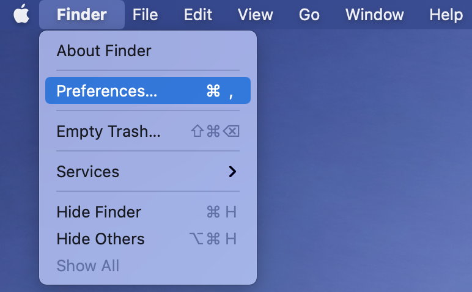
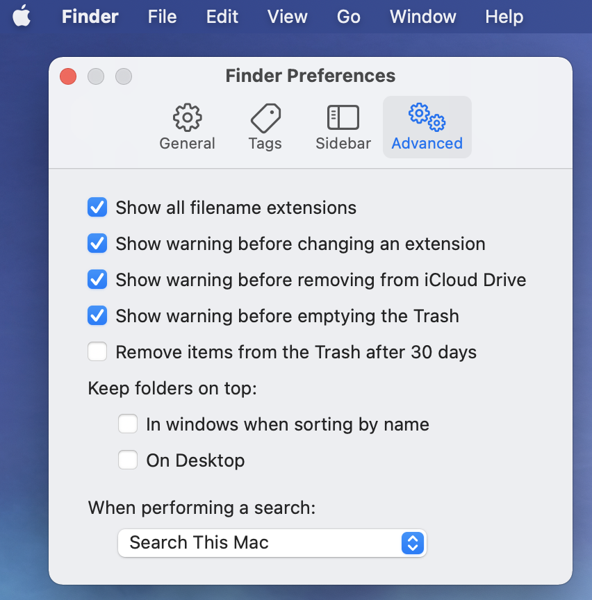
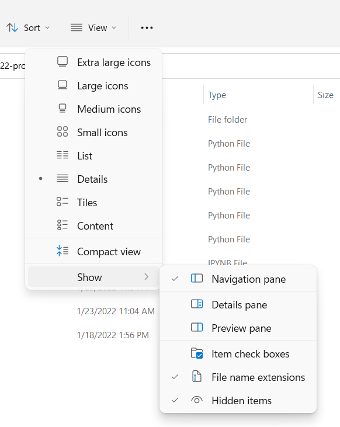
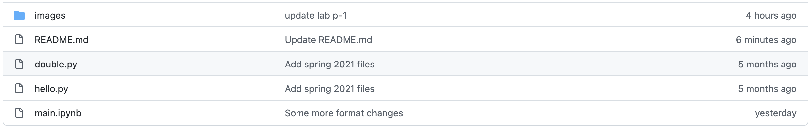
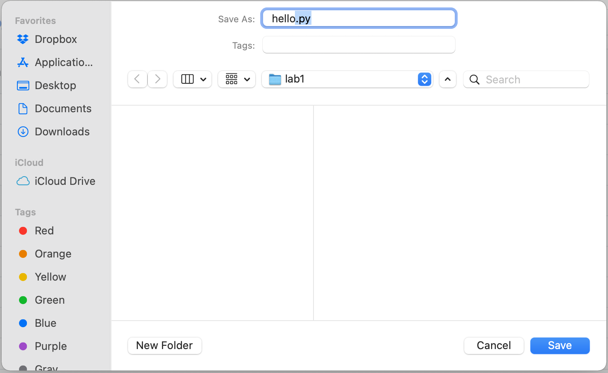
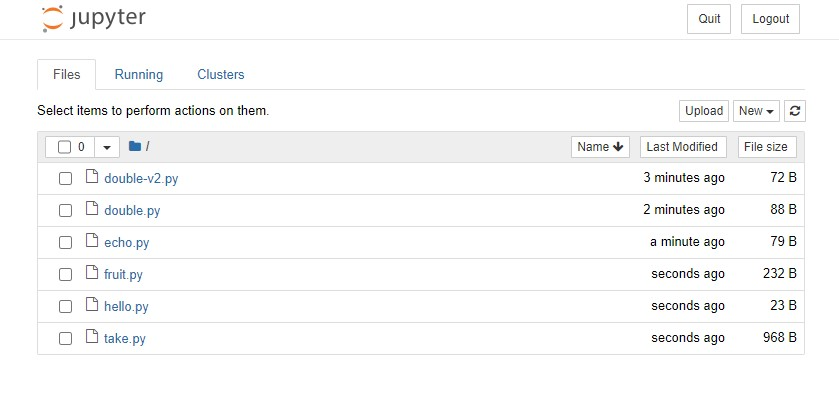
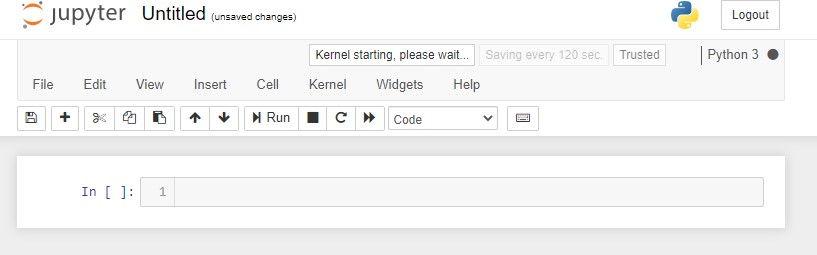
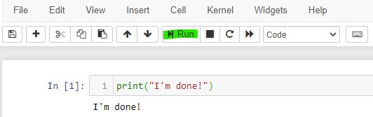

# Lab-P1: Running Programs

Welcome to your first lab!  This semester, you're going to learn how to write your own Python code.  But for this lab, you're just going to practice running some Python programs we give you.

**Important:** Before going to the lab, install Anaconda with Python 3.9 on your laptop. We've created videos showing how to do this on [Windows](https://www.youtube.com/watch?v=EhbuqMshs08) and [Mac](https://www.youtube.com/watch?v=CZQJJX-wl4M). Please make sure that *both* checkboxes are checked during the Windows installation.

**If you have already installed Python or Anaconda before this semester, please uninstall and reinstall, following the instructions in these videos. Please do not upgrade your Python version anytime during the semester. We expect you to retain Python 3.9 throughout this semester.**

As a reminder, labs are a part of your grade and are meant to be guided by a TA/peer mentor. Thus, in-person attendance is mandatory (unless you are a CS319 student or an AmFam student).

The lab is divided into "Segments". You'll have an opportunity to discuss with the class after each segment. Of course, you are free to ask questions during each segment, too.

This lab also contains "Tasks". Pay attention to these, as you'll be expected to be able to do similar tasks on your own moving forward. If you see a Task that says "again", like "4 again", it means that it's very similar to some previous task. So if you are confused about Task 4 again, go back and look at Task 4.

## Learning Objectives

After completing this lab, you will be able to...

* Download files from GitHub
* Use basic terminal commands
* Run a Python script
* Understand and use absolute and relative paths
* Create and run a Jupyter Notebook
* Download and run a Jupyter Notebook


## Segment 1: Download Your First Program

The first thing you're going to need to decide is where to keep your work this semester.

### Task 1.1: Create the folders for this lab
Create a folder named "cs220" under "Documents". Then, inside the new "cs220" folder, create a sub-folder called "lab1" and use it for all your files related to this lab.

To find "Documents"...

#### Windows Users

1. Open File Explorer and select "Documents"


#### Mac Users

1. Open Finder and select "Documents"


___

Before we begin the next task, let's learn about the term "file extension". When you have a file named "somefile.some\_extension", the part after the "." is called the file extension. A ".py" extension refers to a Python program. Other examples of a file extensions include: ".txt" (text file), ".docx" (document file), ".xlsx" (spreadsheet file).

To show file extensions, you will need to...

#### Mac Users

1. Open Finder window and click on Finder (menu) > Preferences:

2. Navigate to "Advanced" and enable "Show all filename extensions":


#### Windows Users

1. In your File Explorer, Click View > Show > File name extensions
   


### Task 1.2: Download the file "hello.py" to your "lab1" folder

**We strongly recommend using Google Chrome browser, throughout this semester. Other browsers might add unpredictable extensions to your files and they might not work as intended.**

At the top of this page, you'll see a list of files, something like this:



Downloading files from GitHub (the site hosting this document) is a little tricky for those new to it. Try this:

1. Right-click on hello.py (the actual text, NOT the white bar it sits in)
2. Choose "Save Link As..." (or similar)
3. Navigate to your "lab1" folder in the pop-up
4. Ensure that you download file with proper extension:
   * Windows users: ensure that "Save as type" is *not* "Text Document" or "text", but is either "Python File" or "All Files".
   * MAC users: ensure that you have followed the above Finder settings steps before this step. Replace the ".txt" extension with ".py".
   * You should be following this process for all downloads from github. Here is another example: if you are downloading a ".ipynb" file, you should make sure the extension is exactly ".ipynb" and not ".txt.ipynb" or ".txt" or ".ipynb.txt".
5. Hit Enter

<p align="center"></p>
<p align="center"></p>

Alright, we've downloaded our first Python file! *Or have we?*

### Task 1.3: Open a "terminal emulator" a.k.a. a Terminal.

**Windows**:

1. Hit the Windows logo key on your keyboard
2. Type "powershell"
3. open "Windows PowerShell" (be careful, DO NOT choose the ones that say "ISE" or "x86")
4. Pin this application to Start bar. If you don't know how to do this, please do a Google Search.

**Mac**:
1. Open Finder
2. Click "Applications"
3. Open "Utilities"
4. Double-click Terminal.app
4. Pin this application to Dock. If you don't know how to do this, please do a Google Search.

We're going to talk more about terminals later - don't worry too much about the details yet.

### Task 1.4: Copy the pathname of your "lab1" folder.  

1. Open your `cs220` folder in either File Explorer or Finder
2. Copy the pathname of `lab1` using either these [Windows directions](https://www.pcworld.com/article/468873/windows-tips-copy-a-file-path-show-or-hide-extensions.html) or [Mac directions](http://osxdaily.com/2015/11/05/copy-file-path-name-text-mac-os-x-finder/)
3. Paste the pathname of `lab1` in your notes somewhere

### Task 1.5: Navigate to the `lab1` directory.

"Directory" is just a fancy word for "folder". You can use them interchangeably. The command to change directories is `cd`, which stands for Change Directory. The directions are the same for Mac and Windows.  Type the following in the terminal (replace `LAB1-PATH` with the pathname of `lab1`, which you copied above; keep the quotes around the pathname, though) and hit enter:

```
cd "LAB1-PATH"
```
So if my `lab1` pathname is "C:\Users\myname\Documents\cs220\lab1", I'd type:

```
cd "C:\Users\myname\Documents\cs220\lab1"
```

If you're using a Mac, your slashes will point the other way. This isn't a big deal... for now.
```
cd /Users/myname/Documents/cs220/lab1
```

### Task 1.6: Use `cat` to inspect hello.py.

Just type `cat hello.py` in your terminal and press Enter. As one might guess, `cat` command enables you to look into the contents of a file.

Wooooooooah! That's a lot of stuff. Wait a minute... we've been bamboozled! This is an HTML file! **Delete this impostor hello.py using your file explorer!**

So, this is the incorrect way of downloading files from github, when you encounter any error while running your program which lists "\<!DOCTYPE html\>", then you followed these wrong steps to download the program file.

### Task 1.7: Correctly Download a Python file

After noticing our mistake, let's download `hello.py` the **correct way**:

1. At the top of this page, Left-click on "hello.py"
2. Right-click on the "Raw" button. **This step is important.**
3. Choose "Save Link As..." (or similar)
4. Navigate to your "lab1" folder in the pop-up
5. Ensure that you download file with proper extension:
   * Windows users: ensure that "Save as type" is *not* "Text Document" or "text", but is either "Python File" or "All Files".
   * MAC users: replace the ".txt" extension with ".py".
6. Press Enter
7. For image reference, please go back to Task 1.2
8. Type `cat hello.py` in your terminal and press Enter. If you downloaded the file correctly, you should now see:

```python
print("Hello, World!")
```

**Warning**: Verify that your file is saved as "hello.py" and not "hello.txt" or "hello.py.txt". Reminder: we recommend you use the Chrome browser to avoid issues (other browsers might automatically change extensions of files to .txt when downloaded). In Chrome, right-clicking the "Raw" button looks like this:


That's the end of this segment! Check in with your TA before moving onto the next one. Be ready for a short discussion!

## Segment 2: Run Your First Program

A "path" is how a computer knows where a file is, and a "pathname" describes a path. Put simply, a pathname is a more complete name for a file or folder.

`hello.py` is just a file name. `C:\Users\myname\Documents\cs220\lab1\hello.py` and `/Users/myname/Documents/cs220/lab1/hello.py` are pathnames. The former is a pathname on Windows and the latter on a MAC or Linux. Windows and MAC or Linux use a different path separator, that is `\` (Windows) and `/` on MAC or Linux. Eventually, you will learn how to handle the `\` (Windows) versus `/` difference in a generic manner.

### Task 2.1: Use a Shell command to list the contents of the lab1 folder
The Shell command we will use is  `ls` (LS, but lowercase) to LiSt and inspect the contents of the lab1 folder.

Type `ls` in the terminal and press enter. If you've done everything correctly so far, you should see the "hello.py" file that you downloaded in Task 2 listed.

### Task 2.2: Run hello.py.

Type `python hello.py` and hit ENTER. Note that you may need to instead type `python3 hello.py`, depending on your setup (on most Mac setups, you'll be typing python3).  If everything is working correctly, you should see the following message printed:

```
Hello, World!
```

Congrats, you just executed your first Python program! That's the end of this segment.
Raise your hand and show a TA your Hello World before moving on.
No discussion for this segment :)

## Segment 3: Use Terminal to run Shell Commands

You should have a terminal open that's working in your `lab1` directory. You have already tried examples for three shell commands, which are: `cat <filename>`, `cd <pathname>`, `ls`. Shell is a program that is run by the terminal application. Shell commands are commands that you type within your terminal window.

Why learn about terminal?
- Typing on keyboard is way faster than using a mouse (also good for your wrist)
- Mastering Terminal will enable you to work on a remote or cloud-based computer

Let's learn more about shell commands.

### Task 3.1: Use `pwd` (Print Working Directory) to see your working directory.

In your Terminal, simply type `pwd` and press Enter.  

You should see that the output looks something like "C:\Users\myname\Documents\cs220\lab1".
The important part is the end: "cs220\lab1".  

Let's learn about two different types of paths:
1. Absolute paths:
	* full path name to your file or folder
	* there can be only one absolute path to a single file or a single folder
	* example: `C:\Users\myname\Documents\cs220\lab1\hello.py` and `/Users/myname/Documents/cs220/lab1/hello.py`.
2. Relative paths:
	* specifying the part of the path relative to current working directory (CWD)
	* example: assuming you are inside the `Documents` directory (that is, you have executed `cd "C:\Users\myname\Documents"` or `cd /Users/myname/Documents`), then `cs220\lab1` or `cs220/lab1` are examples of relative paths to the `lab1` directory.
	* unlike absolute paths, there could be multiple ways of specifying relative paths. Let's say you are inside `Documents\cs220` or `Documents/cs220`. Then the relative path to `lab1` will just be `lab1`. For the same `lab1` directory, we were able to use two different relative paths from two different locations.

### Task 3.2: Navigate to the parent directory of `lab1`, which is `cs220`.

Remember how we used `cd` to go directly to a specific directory using its absolute pathname? We can also use `cd` to move around the file system using relative paths. To go to the parent directory, we use:

```
cd ..
```

`..` is a special reference. It always refers to the parent directory of the current working directory.

### Task 3.3: Use `pwd` to verify that you are now in the `cs220` directory.

### Task 3.4: Use Shell commands to make a directory for next week's lab.

Use mkdir, that is **M**a**K**e**DIR**ectory, to *make* a `lab2` directory.

Here's how:

```
mkdir lab2
```

### Task 3.5: Use `ls` to verify that a `cs220` now contains `lab1` and `lab2`.


### Task 3.6: Navigate back to the `lab1` directory.
Since `lab1` is so close to our current(working) directory, we don't have to use the absolute pathname of `lab1`. We can use a relative path.

You can probably guess that we have to use `cd`. So let's type that first (without pressing Enter!), followed by a space:

```
cd <- (there's a space there... don't type this note)
```

Now press Tab, that key right above your Caps Lock. What happens? Press it multiple times. You should see suggestions.  This can be useful when navigating. This useful shortcut saves you a lot of typing time!

Either one of the following will work:
```
cd lab1
```
OR

```
cd .\lab1\
```
The above options are identical. ".\\" for Windows and "./" for Mac mean "relative to the current directory". The "\\" or "/" *after* `lab1` indicates that `lab1` is a directory.

As an additional exercise, consider the following...

Windows:
```
ls ..\
```
Mac:
```
ls ../
```

What do you think this does?
That's the end of this segment. Raise your hand, and show a TA the result of the above `ls` command.

## Segment 4: Use a Jupyter Notebook to run Python code
You'll be doing the majority of your coding in a Jupyter Notebook file. Let's make one.

### Task 4.1 Start up a Juptyer Notebook
You should have a terminal open that's working in your `lab1` directory. We will be creating a new Jupyter Notebook called `lab.ipynb`.

In your terminal, type `jupyter notebook` and press Enter. This should open up Jupyter as a web page in your browser. If it doesn't, and you've already carefully followed our video install instructions (links at the top of this page), please **immediately ask for help** -- there are probably some tricky configuration issues remaining.

**Note:** even though we'll be working in the web browser now, **NEVER** close the terminal window where you typed `jupyter notebook` until you're done -- if you do, Jupyter will crash and you will lose any unsaved work.

If everything works properly, you'll see something like this (notice you can see your downloaded files in Jupyter):



Click "New", then "Python 3".  A new tab like this should open:



Notice how it says "Untitled" at the top?  Click that word, type "lab", then click "Rename" or press Enter.

### Task 4.2: Write and run code in your Jupyter Notebook

Jupyter notebooks have "cells" where you write code. Cells are these rectangular boxes where you can type code.. We're going to write one line in a cell (copy-paste the below code):

```python
print("I'm done!")
```

To run this cell, click the "Run" button in the toolbar, which is highlighted green in the image below. You should see the output below the cell, as pictured.



Alternatively, you can click Kernel -&gt; Restart & Run All.

### Task 4.3: Save your notebook.

Jupyter's autosave is quite unreliable, so make sure to frequently hit the save button. It is the "save icon". Keyboard shortcut for this would be `command + s` or `ctrl + s`.

### Task 4.4: Download a different Notebook file.

Download `main.ipynb` using the same steps as Task 1.7. Make sure that the extension is `.ipynb`. Now refresh the browser tab containing the `jupyter notebook` homepage. You should be able to see `main.ipynb` in the list of files. Open `main.ipynb` and run the cell containing the code.

Most lectures will have live-coding examples, so you will be doing this step at the start of each lecture.

This is the end of segment 4. Raise your hand and show your TA the output of the notebook you just downloaded. No discussion for this segment.

## Segment 5: Reading Code

Close EVERYTHING related to the previous segment. The browser, the terminal, everything.

Then open a new terminal and cd to the `lab1` direcory.

Before we move onto the next program, let's have a look at hello.py again.

### Task 5.1: Use `cat` to see the contents of hello.py.

You should see the following:

```python
print("Hello, World!")
```

What you're looking at is the code for the hello.py program. Feel free to use `cat` in the following steps to view the code of other programs.

### Task 5.2: Download `double.py` to your `lab1` folder.

At this point, you should still have a terminal that is working in your `lab1` folder (a.k.a. directory).

### Task 5.3: List the contents of your lab1 directory.

It should contain hello.py, lab.ipynb, main.ipynb, and double.py.

### Task 5.4: Run double.py.  

Type the following and press ENTER (Reminder: most of the MAC users will have to type `python3` instead of `python`):

```
python double.py
```

The program will say `please enter a number:`. This is known as a "prompt" (a fancy way to say a program is asking you a question).

Type `5` and press ENTER.  Make sure that the program tells you the answer is `10.0`.

### Task 5.5: Use Up Arrow to view previous commands
While using the terminal, press the up arrow key to scroll through the previous commands.

If you press the up arrow key once, the prompt should show `python double.py` again. You can use the up and down arrow keys to go through your command history. Press Enter to run `double.py`, and this time try entering a negative number.

Let's run double.py one last time, but now when you're prompted for a number, **enter the word `five`**.  

Do you see something like this?

```
Traceback (most recent call last):
  File "double.py", line 2, in <module>
    print("2 times your number is " + str(2*float(x)))
ValueError: could not convert string to float: 'five'
```

When you see the word "Traceback", **it means the program crashed**.  The double.py program can only accept digits so it crashed when you typed something else.  Eventually, we'll learn how to understand what gets printed when a program crashes to identify the root of the problem, but for now we won't worry about it any further.

That's the end of segment 5! Show this traceback to a TA. There will be a short discussion.


Congrats on finishing your first CS 220 lab! You do not need to submit anything for the labs. The labs are designed to prepare you for the project and help you engage in the lab sessions run by TAs and peer mentors. Your TA will come around to check that you finished and enter your lab attendance points on Canvas.

Good luck with [P1](https://github.com/msyamkumar/cs220-s22-projects/tree/main/p1)!
