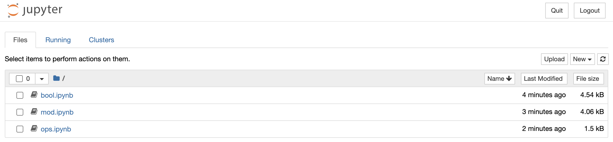
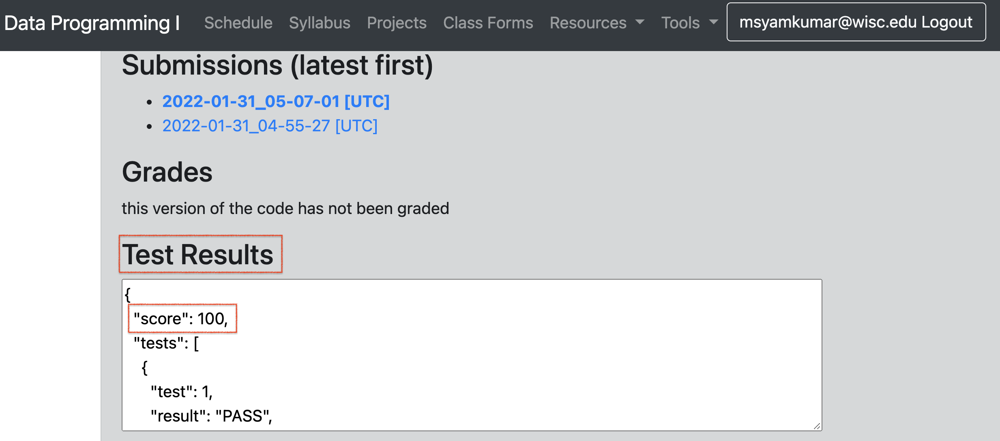

# Lab-P2: Python Modes and Programming

In lecture this week, we learned about three ways to run Python: interactive mode, script mode, and notebook "mode" (people outside of 220 won't use that vocabulary for notebooks, hence the quotes). In this lab, you'll practice those three modes. You'll also get practice with operators, modular arithmetic, and Boolean logic.

To get started, please create a `lab2` directory inside your `cs220` directory (if you haven't already).  Then, open a terminal and use `cd` to navigate to `lab2` (you may need to review the steps from [lab-p1](https://github.com/msyamkumar/cs220-s22-projects/tree/main/lab-p1) to remember how to find the pathname of the `lab2` directory).

## Learning Objectives

After completing this lab, you will be able to...

* Run Python code using interactive mode, script mode, and notebook "mode"
* Write Python expressions containing mathematical, comparison, and Boolean operators
* Identify correct operator precedence order
* Apply parentheses to override operator precedence in your expression, when needed
* Translate English statements into Python expressions
* Write correct Boolean expressions with subparts separated by Boolean operators of `or` and `and`

------------------------------
## Segment 1: Interactive Mode (Python Shell)

Let's start by looking at interactive mode, where code is executed one line at a time. Interactive mode is typically used for doing quick syntax checks. For a new Python programmer, interactive mode is very helpful to try out simple examples.

### Task 1.1: Determine your python version.

Run `python --version` in the terminal.  You might see something like this:

```
Python 3.9.7
```

If it says something like 2.X.X, try running `python3 --version` instead. If you need to run the latter, please use `python3` whenever we say `python` in the directions this semester.  

Many commands support some type of version argument. How do you think you could figure out the version of Jupyter?

### Task 1.2: Use `pwd` to verify that you are in the `lab2` directory.

If not, use cd commands to go there.

### Task 1.3: Start Python in **interactive** mode.

Type `python` and hit `ENTER`.

You should see something roughly like this (details will vary):

```
Python 3.9.7 (default, Sep 16 2021, 16:59:28) [MSC v.1916 64 bit (AMD64)] :: Anaconda, Inc. on win32
Type "help", "copyright", "credits" or "license" for more information.
>>>
```

Those `>>>` symbols are a Python prompt.  This means you can type Python code, but your shell commands will not work until you exit Python again. Recall that we learnt about shell commands in lab-p1. Examples of shell commands: cd, ls, mkdir, etc., 

### Task 1.4: Run Python in interactive mode.

Try typing this Python code:
```python
print("hi")
```
then press `ENTER`.  The message `hi` should be printed.

### Task 1.5: Try running a shell command in interactive mode.

Ensure you still see the `>>>` prompt, then type `pwd` again and hit ENTER. This should give you the following error, because `pwd` is only valid in the shell (not Python):

```
Traceback (most recent call last):
  File "<stdin>", line 1, in <module>
  NameError: name 'pwd' is not defined
```

### Task 1.6: Exit interactive mode.

You can exit interactive mode by typing in `exit()` and pressing `ENTER` (works on both Mac and Windows). 

Alternatively, on Mac, you can do this with `CONTROL-D` (hold down the control key, then press the D key at the same time).  
Alternatively, on Windows, you can use `CONTROL-Z ENTER` (hold down the `CONTROL` key, then press the `Z` key at the same time; release both, then press the `ENTER` key). 

### Task 1.7: Try running python code in the shell.

Now that you've exited, try running both `pwd` and `print("hi")` again.  This time, the former should work and that latter should fail (because we're in the shell, and the former is a shell command whereas the latter is Python code).

### Task 1.8: Re-enter interactive mode

Type `python` and hit `ENTER`.

### Task 1.9: Evaluate Python expressions

Type each of the below expression, predict the output and then press `ENTER`, to confirm that you are getting the expected output.

* `10/4`
* `10//4`
* `10%4`
* `not False`
* `not not True`
* `not not not True`
* `2*1000`
* `"2"*1000` (what's the difference between this one and the previous one?)
* `2**1000` (and what about this one?)
* `1/0` (should fail)
* `"ha"*100`
* `"ha\n"*100`
* `print("ha\n"*100)`
* `print("ha\n\n"*100)`

### Task 1.10: Exit interactive mode.

That's the end of the first segment! Take a moment to summarize for yourself what you learned. If you aren't sure about anything above, ask a TA to check your output. If you feel good, move on.

------------------------------
## Segment 2: Boolean Logic

In this section, you'll get more practice downloading and running existing notebooks.

### Task 2.1: Download `bool.ipynb`, `ops.ipynb`, and `mod.ipynb`

You can find them in the lab-p2 folder of the GitHub Repo - which is where you are now. Download these files to your `lab2` folder.

You need to follow the same procedure as you did to download files in lab-p1. This means:
* Click on the link to the notebook
* Right-click the Raw button
* Click "Save Link as"
* Ensure that the save type is "All Files"
* Manually type the ".ipynb" extension after the filename. So for example, "bool" would become "bool.ipynb"
* Hit Save
* If the files got downloaded with an extra `.txt` extension, for example `bool.ipynb.txt`, make sure to run this shell command to fix the extensions for all the files: `mv bool.ipynb.txt bool.ipynb`.

### Task 2.2: Open Jupyter in your `lab2` folder.

In the terminal (which should still have `lab2` as the current working directory), run `jupyter notebook`.  You should see something like the following:



You can now click on any of the three notebooks you've downloaded to view the contents. The exercises you should do with each notebook are described below.

### Task 2.3: Complete the `bool.ipynb` notebook.

Open the notebook, complete the directions in each cell, and run the cell.   If you are unsure of what to do, ask your TA. And again, if you are unsure about anything, you should ask a TA to check your work before moving to the next segment. There may be a short discussion after this.

------------------------------
## Segment 3: Order of Operations

Python has operator-precedence rules to determine which operator to execute first, if an expression contains multiple operators.

Of course, the Python programmer (you!) can add parentheses to change the order in which the operators are executed, thereby changing the result.

### Task 3.1: Open the `ops.ipynb` notebook.

### Task 3.2: Complete the tasks in `ops.ipynb` notebook.

The `ops.ipynb` notebook is split into 2 segments.

#### Task 3.2.1: Using parentheses, fix each cell to get the correct result.

For example, in the first cell, `3**4 - 1` evaluates to 80, but you should change it to be `3 ** (4-1)`, thereby getting 27.

By the way, the singular form of "parentheses" is "parenthesis". Just like hypothesis vs hypotheses.

#### Task 3.2.2: Go through correct versus incorrect boolean expressions
This is a very important part of this lab. Make sure that you understand this section clearly. If you have any clarification questions, please ask TA / PM.

------------------------------
## Segment 4: Modular Arithmetic

What time does an analog clock show one hour after twelve o'clock?  Not 13 o'clock (that doesn't exist) -- instead, it wraps back around to 1 o'clock.  This is a weird kind of arithmetic, where adding doesn't always make a number larger.

This alternative arithmetic is called **modular arithmetic**, and we can use the modulo operator (`%`) in Python to perform modular addition.  However, there's a twist with respect to the clock: in CS, we count from 0, so if we were to have a **CS clock**, it would go from 0 o'clock to 11 o'clock (instead of from 1 o'clock to 12 o'clock).

### Task 4.1: Open and run the `mod.ipynb` notebook.

You'll see many cells of the form `X%12`.  This computation is answering the question: *if we start at 0 o'clock and wait `X` hours, what time is it?* The `%12` part means time wraps around at 12 o'clock, meaning that there is no 12 o'clock, just 0 o'clock again (remember we have a CS clock that goes from 0 to 11 o'clock).

### Task 4.2: Solve math problems by using the modulo operator.

For each question below, write a Python expression using `%` to answer the question.
Put each expression in a different cell.

* What time will it be 6 hours after 9 o'clock? (run `(9+6) % 12` in a cell to find the answer, which is 3 o'clock)
* What time was 2 hours before 1 o'clock? (run `(1-2) % 12` in a cell to find the answer, which is 11 o'clock)
* What time was 4 hours before 2 o'clock?
* What will it be 12 hours after 6 o'clock?
* What will it be 13 hours after 6 o'clock?
* What will it be 24 hours after 6 o'clock?
* What will it be 25 hours after 6 o'clock?

OK, we are done practicing! There may be a short discussion near the end.

------------------------------
## Segment 5: Script mode (IDLE editor)

Script mode is the most commonly used mode for writing production Python code (that is code written at a company). In this course, we will only be writing code in notebook "mode". So this section will be the only place where you will briefly learn about script mode. 

Now let's look at IDLE, which will help us write a python script.

### Task 5.1: Open IDLE

Open a new file called "laugh.py" in IDLE (short for Integrated Development and Learning Environment, but it's basically a fancy text editor). From shell mode (that is, not python interactive mode), type `idle laugh.py`.  This would normally open up a file named `laugh.py` in IDLE if it already existed, but since it doesn't, it will create a new empty file named `laugh.py`.

If you are using MacOS, try the command `idle3 laugh.py`

**Warning**: If you are using MacOS and `idle3 laugh.py` command did not work, then directly open IDLE from `Finder` and save the new file as `laugh.py`.

### Task 5.2: Write some code in IDLE.

Paste the following into the editor:

```python
print("ha " * 10 + "!")
```

### Task 5.3: Run code in IDLE.

From the run menu, click `Run Module` (saving your file if necessary); or, you can accomplish the same by hitting `F5` on your keyboard.

You should see a new window pop up. In this window, you should see:
```
ha ha ha ha ha ha ha ha ha ha !
```
along with `>>>` underneath. What do you think those arrows signify?

### Task 5.4: Use python interactive mode in IDLE.

Type or paste `print("hello")` in the pop-up's `>>>` prompt and hit Enter.

Now close the pop-up.

### Task 5.5: Investigate how script mode handles code that doesn't use print().

Remove the print in your file, so it looks like this:

```python
"ha " * 10 + "!"
```

Run your code again (e.g., with `F5`).  Notice how it doesn't show any of your output? In interactive mode, prints usually aren't necessary, but they are in script mode. Add back the print, save, then close any IDLE windows that are open.

### Task 5.6: Run the python program you wrote from the shell (back to your terminal).

```
python laugh.py
```
Did it work? If you are on a MAC, try `python3 laugh.py`.

### Task 5.7: `circle.py` program
Let's try to create a second program:

1. Run `idle circle.py` (`idle3 circle.py` on MacOS)
2. Paste `print((8/2)**2 * 3.14)`
3. Run the program (either in idle with `F5`, or by exiting idle and running `python circle.py` in the shell)

The program computes the area of a circle. *Can you figure out what the diameter of that circle is by reading the code?*

That's the end of this segment! Take a moment to summarize for yourself what you learned.
If you aren't sure about anything above, ask a TA to check your output.

------------------------------
## Segment 6: Auto-grader tests check for project submission

This segment is informational only and has no tasks. Starting with project P2, your work is not complete when you submit the project on the course website. It is your responsibility to make sure that your project clears auto-grader tests on our test system. Approximately 4 hours after you submit your program, auto-grader test results will become available. 

If your project submission has successfully cleared auto-grader tests, you will see a `score` within the `Test Results` box of your submission (please see below screenshot). If you don't see `score` and see some error, that indicates that your submission did not clear auto-grader tests. It will be **your responsibility to visit office hours** and do the necessary follow-ups to make sure your project clears the auto-grader tests.



To get full credit for this lab, you must acknowledge to the TA that you understand Segment 6's instructions.

If you finished early, start on [P2](https://github.com/msyamkumar/cs220-s22-projects/tree/main/p2)! Good luck!
