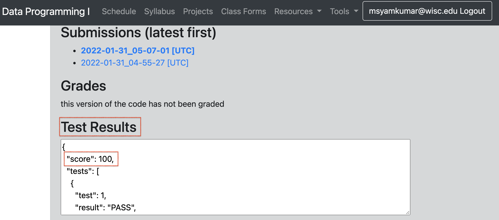

# Lab P6: Real-world Datasets (Airbnb)

In this lab, you will practice accessing CSVs, sorting, and using sets. You will work with a real-world dataset and deal with issues that arise when using such datasets.

### Corrections/Clarifications

None yet

**Find any issues?** Report to us:

- Adil Ahmed <oahmed4@wisc.edu>
- Ishita Dhoot <idhoot@wisc.edu>

------------------------------
## Learning Objectives

In this lab, you will practice how to...
* Access and utilize data in CSV files
* Deal with messy real-world datasets
* Use string functions to compare and extract data values
* Use sorting functions to order data
* Use data structures such as lists and sets to manage data

------------------------------
## Note on Academic Misconduct

You may do these lab exercises with only with your project partner; you are not allowed to start working on lab-p6 with one person, then do the project with a different partner.  Now may be a good time to review [our course policies](https://www.msyamkumar.com/cs220/s22/syllabus.html).

------------------------------

## Project partner

We strongly recommend students to find a project partner. If you are still looking for a project partner, take a moment now to ask around the room if anyone would like to partner with you on this project. Then you can work with them on this lab as well as the project.

------------------------------
## Segment 1: Setup

Create a `lab6` directory and download the following files into the `lab6` directory.

* `airbnb.csv`
* `practice.ipynb`

If you found your `.csv` file is downloaded as a `.txt` file (e.g. `airbnb.txt` instead of `airbnb.csv`), run `mv airbnb.txt airbnb.csv` from your Powershell/Terminal to change the extension of the file into `.csv` file manually. All the data that we need for p6 is stored in `airbnb.csv`

To start, familiarize yourself with the dataset (`airbnb.csv`). Examine its contents using Microsoft Excel, Numbers (Mac) or any other spreadsheet software.

------------------------------

## Segments 2-5: Airbnb

For the remaining segments, detailed instructions are provided in `practice.ipynb`. From the terminal, open a `jupyter notebook` session, open your `practice.ipynb`, and follow the instructions in `practice.ipynb`.

------------------------------
## Segment 6: Auto-grader tests check for project submission

This segment is informational only and has no tasks. 

**Important:** It is your responsibility to make sure that your project clears auto-grader tests on our test system. Approximately 4 hours after you submit your program, auto-grader test results will become available.

**Late days will be counted if your project does not clear auto-grader.** Your project will not be accept 7-days after the due date, *even if it was just an auto-grader failure.*

If your project submission has successfully cleared auto-grader tests, you will see a `score` within the `Test Results` box of your submission (please see below screenshot). If you don't see `score` and see some error, that indicates that your submission did not clear auto-grader tests. It will be **your responsibility to visit office hours** and do the necessary follow-ups to make sure your project clears the auto-grader tests.

To get full credit for this lab, you must acknowledge to the TA that you understand Segment 6's instructions.

**IMPORTANT:** Starting with project p6, resubmissions will **not be allowed**. It is important that you review the grading rubric prior to submission of your project, to make sure you won't lose any points during code review.

## Project

Good luck with [p6](https://github.com/msyamkumar/cs220-s22-projects/tree/master/p6)!
