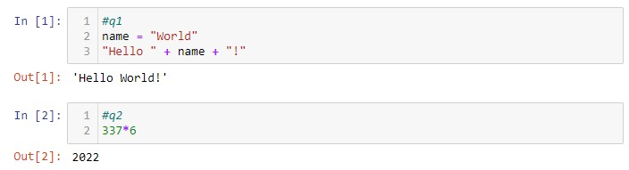
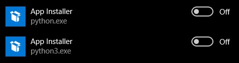
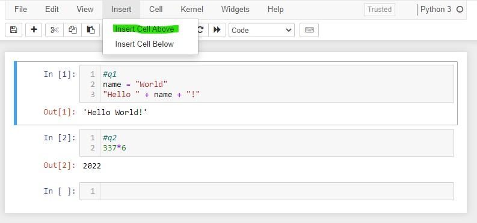
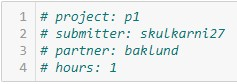

# Project 1 (P1)

## Clarifications/Corrections

None yet.

**Find any issues?** Report to us:

- SAURABH KULKARNI <skulkarni27@wisc.edu>
- ZACHARY JOHN BAKLUND <baklund@wisc.edu>

## Learning Objectives

In addition to the learning objectives of Lab 1
* Download files from GitHub
* Use basic terminal commands
* Run a Python script
* Understand and use absolute and relative paths
* Create and run a Jupyter Notebook
* Download and run a Jupyter Notebook


you will learn to:
* Run tests
* Turn in your project

## Relevant lectures
None for P1.

In subsequent projects, you'll need to carefully follow the [course policy](https://www.msyamkumar.com/cs220/s22/syllabus.html) to avoid academic misconduct, but for this project, we just want to walk
through the process.  Feel free to get any kind of help from anybody (fellow students or otherwise) **only** for P1.

## Step 1: Setup

You should have a folder `cs220` that you created for lab-p1 under `Documents`. We're assuming you did the lab and know how to do all the Tasks we mentioned. If you're confused about any of the following steps, refer back to your lab.

#### Create a sub-folder called `p1` in your `cs220` folder
Refer to Task 1.1 (from lab-p1), if you need help.  

This will store all your files related to p1. This way, you can keep files for different projects separate (you'll create a `p2` sub-folder for the next project and so on). Unfortunately, computers can crash and files can get accidentally deleted, so make sure you backup your work regularly (at a minimum, consider emailing yourself relevant files on occasion).

#### Download `test.py` to your `p1` folder.
Refer to Task 1.7 (from lab-p1), if you need help.

#### Download `questions.py` to your `p1` folder.
Refer to Task 1.7 (from lab-p1) again.

#### Open a terminal in your `p1` folder.
Refer to Task 1.3-1.5 (from lab-p1).

#### Use `cat` to look at `questions.py`
Reflect and consider: What do you think we use `questions.py` for?

#### Create and open new notebook called `main.ipynb`
Refer to Tasks 4.1-4.3 (from lab-p1).

Please name your notebook "main". This is necessary because our test file only recognizes notebooks with this name. Now, if you go back to File Explorer or Finder and open the `p1` folder, you should see a file named `main.ipynb` (though the extension of ".ipynb" may be hidden depending on your
computer).  *This is the file you'll hand in at the end.*

## Step 2: Copy/Paste Code

Now you're going to run some Python code.  We don't expect you to write your own code for this project yet, so you'll just copy/paste what we provide.

In the first cell (the box adjacent to `In [ ]`), paste the following:

```
#q1
name = "World"
"Hello " + name + "!"
```

Then hit SHIFT+ENTER on the keyboard (this means you should first press and hold down the SHIFT key, then press the ENTER key at the
same time). This does the same thing as clicking the Run button from the lab (Task 4.2).  

There should now be an `Out [1]` area saying this:

```
'Hello World!'
```

A new input box (called a "cell") will also have been created automatically for you.  Let's paste this in that cell:

```
#q2
337*6
```

Hit SHIFT+ENTER again to run it, and you'll see an output of `2022`.

At this point, your notebook should look like this:



Let's paste and run one more cell:

```
"oops"
```

What would you do if you want to delete that last cell?  Try clicking in the cell where you typed "oops".  Then hit the ESCAPE key on your keyboard.
Notice how the cell border changes from green to blue?  That means the notebook is in command mode, so whatever you type will trigger
commands (instead of adding text to the box).  Hit the "d" key twice, and see how the cell gets deleted.  This will be handy whenever you
make a mistake or want to delete your scratch work. Delete this "oops" cell we created.

## Step 3: Run the Tests

Remember the test.py file we asked you to download?  That file is a Python program that you can run to check whether your notebook looks
correct before you turn it in.  Here are the steps to use it:

1. In your notebook, click "Kernel" from the menu, then click "Restart & Run All"
2. Confirm "Restart & Run All Cells"
3. Click the Save button
4. Open a *new* terminal in your p1 folder (**important: leave the previously opened one undisturbed**)
5. Type `python test.py` and hit ENTER; if that doesn't work, try `python3 test.py`; if that still doesn't work, please get help during office hours.

If everything is setup properly and your notebook is correct, you'll see something like this:
```
Running notebook:

[NbConvertApp] Converting notebook C:\Users\skwis\Documents\Masters\SP22CS220\p1\main.ipynb to notebook
[NbConvertApp] Executing notebook with kernel: python3
[NbConvertApp] Writing 1227 bytes to C:\Users\skwis\Documents\Masters\SP22CS220\p1\cs-220-test.ipynb

Checking question: 1
Checking question: 2

Summary:
    Test 1: PASS
    Test 2: PASS

    TOTAL SCORE: 100.00%
```

If you see the following:

```
Can't find a default Python.
Python was not found; run without arguments to install from the Microsoft Store, or disable this shortcut from Settings > Manage App Execution Aliases.
```
You can get rid of that by going to Settings, searching for "Manage Execution Aliases" and disabling the Python App Installers:




If you get an error saying "No module named jupyter", you almost certainly have an installation issue. This is most easily resolved by uninstalling the default version of Python that comes with your system. It is best to get help from Office hours for such installation issues.

The only thing you need to care about for now is that last line: `100.00` means you're passing 100% of the tests.

In general, for tests to be helpful, make sure you always do the "Restart & Run All Cells" and "Save and Checkpoint" steps described above.  


## Step 4: Hand in the Project

Before you can hand in the project, you need to add a few more details to the top of your notebook.  

You've seen how you can insert a cell *below* the one you're working with already. To add a cell *above* the first one, click on the first cell, then click Insert-&gt;Insert Cell Above. See the picture below:



Paste the following in that new cell:

```python
# project: p1
# submitter: NETID1
# partner: NETID2
# hours: ????
```

Replace `NETID1` with your Net ID (usually the part before "@wisc.edu" in your student email address).  If you worked with a partner, replace `NETID2` with your partner's Net ID; otherwise, replace NETID2 with "none". For `hours`, estimate how many hours you spent on this project, eg. 1.5 for one and half hours, 0.17 for 10 minutes.

See this picture for an example:



If you worked with with a partner, **there should only be one submission between you** (please don't double submit), and make sure that `submitter`
refers to the one actually submitting the code (not the other partner).

To hand in the notebook, complete the following steps:
1. Kernel-&gt;Restart and Run All (check for errors)
2. Save
3. Run the tests one last time (after you've added your Net ID info). **Refer to Step 3**
4. Go to [https://www.msyamkumar.com/cs220/s22/submission.html](https://www.msyamkumar.com/cs220/s22/submission.html)
5. Select "Project 1"
6. Click "Choose File" and find your main.ipynb file
7. Click "Submit"
8. Check the "Submission Status" below; it is normal to see some "info:" messages, but make sure you correct any "error:" messages
9. Click "View Submissions" to make sure your submission looks correct

Congrats on finishing your first CS 220 project!
