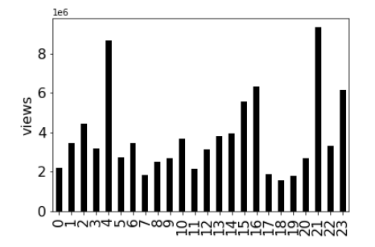
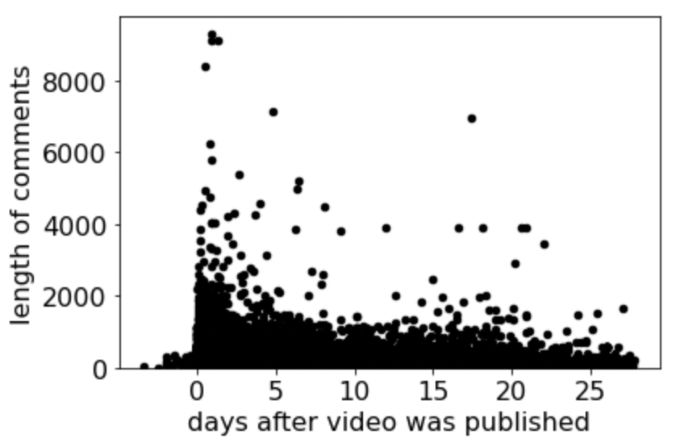

# Project 11: Analyzing Youtube Data (Stage 2)

## Clarifications/Corrections

4/13, 11:30PM:
- A **major bug** was detected in the plot for Q3. The verification script and the image have been changed accordingly.
- The x and y axes were flipped for the verification script for Q8 and Q9. They have been corrected.
- To get the fixes, please **redownload** `plot_points.json` from the github repo. The version inside `p11.zip` has also been updated.  

4/14, 12:30PM:
- This README previously referred to the data structure that mapped comment ids to Comment objects as `comment_data` instead of `comments`. The correct name is `comments`.

4/14, 10:00PM:
- A previous version of `questions.py` required that the lists provided to `verify_scatter` be in the "expected" order. However, order does not matter for scatter plots, so we've updated `verify_scatter` to allow for any order as long as the x,y pairs are associated correctly. If your scatter plot looks right but you are unable to get the verification to pass, please redownload `questions.py`

4/15, 1AM:
- For Q20, the relationship between channel names and author IDs was clarified.

4/15, 12:30PM:
- `questions.py` was upgraded to explain the reason for verification failure and to allow for some tolerance when comparing against floats. Please redownload `questions.py` you're struggling to verify your plots.

**Find any issues?** Report to us:  

- Saurabh Kulkarni <skulkarni27@wisc.edu>
- Yiwu Zhong <yzhong52@wisc.edu>
- Dakota Sullivan <dsullivan8@wisc.edu>

## Learning Objectives

In this project, you will

- Gain more experience with dictionaries and namedtuples
- Practice making bar and scatter plots using pandas and matplotlib
- Analyze the data from p10
- Remove outliers to make the plots more useful
- Use recursion to gather new data

## Coding Style Requirements

Remember that coding style matters! **We will deduct points for bad coding style.** Please refer to the [Code Style Requirements in p10](https://github.com/msyamkumar/cs220-s22-projects/tree/main/p10#coding-style-requirements).

**Warning**: Please do not use the method `csv.DictReader` for p11. Although the required output can be obtained using this method, one of the learning outcomes of this project is to demonstrate your ability to build dictionaries with your own code.

## Setup

To simplify things, we've created a starter zip for you. Just download `p11.zip` from Github and extract it in your cs220 folder. This will create a `p11` folder with all the files you need.

In `main.ipynb`, add the following header, and fill out your information:
```python
# project: p11
# submitter: NETID1
# partner: NETID2
# hours: ????
```


## Introduction

In this project, you'll be analyzing the cleaned data from p10.

**Please go through [lab-p11](https://github.com/msyamkumar/cs220-s22-projects/blob/main/lab-p11) before working on this project.** The lab introduces some useful techniques (e.g., making scatter plots) related to this project and walks you through the setup process for the required data structures and functions.


---
## Data Structure/Function Requirements
Your first code cell should contain all the `import` statements mentioned in lab-p11. You will also need:

```python
from datetime import datetime as dt #this is for a time_delta only
from questions import view_plot_data, verify_bar, verify_scatter
```
for reasons that will become clear later.

You may also want:
```python
import copy
```

The cell below the imports should contain:
```python
%matplotlib inline
```

The cells below this should set up all the required data structures such as `videos` and `comments` and functions such as `plot_dict` and `scatter` as specified in the lab.

<!---
```python
#import statements
import csv
import json
import os
import matplotlib
import pandas #this is only for plotting
from datetime import datetime as dt #this is for a time_delta only
%matplotlib inline

#data structures
Comment
comments
videos

#functions
list_paths_in(pathname)
get_mapping(pathname) #returns a dict
get_comment_data(comment_file) #returns a dict
bucketize(attribute, videos) #returns a dict
plot_dict(d, label="Please Label Me!!!") #given to you in lab 9
scatter(x, y, xlabel="please label me!", ylabel="please label me!") #given to you in lab 11
```
--->
You are expected to use `videos` or `comments` as the source of all of your video data. Do not read the data files again.
<!---
`videos` should be a **dict** that maps each video ID (str)
to another **dict** that represents the video and has the following keys:

* title (str)
* channel_name (str)
* published_at (str)
* duration (str)
* category (str)
* tags (list)
* views (int)
* ratings_enabled (bool)
* likes (int)
* dislikes (int)
* comments (list)

`comments` should be a **dict** that maps each comment ID (str) to a **namedtuple** object called `Comment` with the following attributes:

* video_id (str)
* comment_text (str)
* author_id (str)
* likes (int)
* published_at (str)

To verify that you have set up the data structures properly, verify that the outputs of the following lines of code are as follows:

```python
>>> len(videos)
494

>>> videos['Meaw4DlhNRE']
{'title': 'RCXD Cars Are Bugged Right Now, Right? #warzone #callofduty #pipboyfresh',
 'channel_name': 'PipBoyFresh',
 'published_at': '2021-10-15 05:05:29',
 'duration': '00:00:40',
 'category': 'Gaming',
 'tags': ['RCXD',
  'call of duty',
  'warzone',
  'cod',
  'cod warzone',
  'rebirth Island'],
 'views': 140227,
 'ratings_enabled': True,
 'likes': 7205,
 'dislikes': 184,
 'comments': ['UgyM3VJ1ZqheEcYGyhN4AaABAg',
  'UgyOGb4xFoB-5SHqcGd4AaABAg',
  'UgzWJTvj-SxcplTy6Dl4AaABAg',
  'UgzY0Hv2rz7xNOGtjOd4AaABAg',
  'UgyU4_dOvQ68A8CjTEN4AaABAg',
  'UgwI-evXIVHlFu_lIOR4AaABAg',
  'UgzOBQ8a8vs99bd80vd4AaABAg',
  'Ugy2-XHgKIs1jWGbvtV4AaABAg',
  'UgzWzUB8smXpYVJ1CCx4AaABAg.9TXyxMIjqiM9Tb_piOmfyr',
  'Ugwg8CrvGJTcRkT7HYd4AaABAg',
  'UgzDHOMlvGelavHoLWh4AaABAg',
  'UgzJ6kTW72Yb3sNE2xZ4AaABAg']}

>>> len(comments)
199970

>>> comments['UgwmuJuGrEeY8XS2T394AaABAg']
Comment(video_id='ex98DxvUiAc', comment_text='greetings from Indonesia 🙏🙏', author_id='UCniG6Ko7ATts7fMKHLMbcog', likes=0, published_at='2021-10-01 15:27:57')
```
-->
---

## Food for thought

<!---For questions where you need to make histogram plots, **do not** simply copy the dictionaries provided above the plots. Instead, use them to verify with the dictionaries you created.--->

<!---For the questions where you have to give a plot (Q1 - Q9, Q12, Q13), we will **manually verify** the correctness of the code you wrote and the plots you created.--->

Since we will be analyzing data in this project, there will be some interesting questions for you to think about at the end of some coding questions. These questions will be *italicized*, and you **do not have to** answer them. If you'd like to, you can leave an answer as a comment. Please remove any code related to these Food for thought questions before submitting.

While we tried our best to give you an insight into the data, the primary purpose of the assignment is to let you practice the learning objectives of the course.

---

In p10, we parsed data from multiple files about trending YouTube videos and comments. We cleaned the data, and
stored it in easily accessible data structures. Now that we're done with setup, we can get to analyzing
this data, and figure out how to become a successful YouTuber ourselves!

Let us first figure out *how long* our videos have to be, if we want them to be popular!

### Function requirement:

If we want to analyze the durations of the videos, bucketizing the videos by `duration` directly will not be particularly useful. This is because
unlike something like genres from p8, durations are continuous. It is not very interesting to see how many videos are *exactly* five minutes long. It is more interesting to see how many videos are *between* five and ten minutes long.

For continuous data (such as durations), we will need to create [histograms](https://en.wikipedia.org/wiki/Histogram) to visualize them. The following code will allow you to process a single time duration in 'hh:mm:ss' format as a string and compute which increment of 5 minutes it fit within.

```python
def process_duration(duration_str):

    duration = int(duration_str[0:2]) * 3600 + int(duration_str[3:5]) * 60 + int(duration_str[6:8])
    value = (duration // 300) * 5

    return value
```

So any duration between 0 minutes and 4:59 would become `0`, any duration between 5 minutes and 9:59 would become `5` and so on.

Here's how this function works:
```python
process_duration('00:04:12') returns 0
process_duration('00:28:21') returns 25
```

---

## Plot verification

We've upgraded questions.py to help you with plot verification. Here is the import statement you need to use it:

```python
from questions import view_plot_data, verify_bar, verify_scatter
```

You will be required to verify all of your plots. To do this, you'll have to **make a new cell** directly before or after each of your plots and use one of these 2 functions:

```python
#q<qnum>.1
verify_bar(<your_dict>, <qnum>)
```
or
```python
#q<qnum>.1
verify_scatter(<your_x_list>, <your_y_list>, <qnum>)
```
Note that the data parameters (your_dict for bar and your_x_list, your_y_list for scatter) are the values that you pass to `plot_dict` or `scatter`. Please use more meaningful variable names in your solution.

Here's a concrete example for Q1:
```python
#q1.1
verify_bar(duration_bins, 1)
```
and another for Q7:
```python
#q7.1
verify_scatter(views_q7, comments_q7, 7)
```

These functions simply output `True` if you pass and `False` if you fail. `test.py` checks this output to ensure your data is correct.

At any point, if you're curious about what your plot data is supposed to look like, you can use the following:

```python
view_plot_data(<qnum>)
```
**Do not use any calls to `view_plot_data` in your final submission**. It is purely for debugging purposes. We will consider any use of this function in your submission to be hardcoding.

---
### #Q1: Plot the distribution of video durations as a histogram.
#### #Q1.1 Verify your plot using `verify_bar`


Your output should be a **bar** graph with the horizontal axis representing the time bins of size 5 minutes each, and the vertical axis representing the number of videos in each time bin.

Do not mutate any previously created data structures.

**Requirements:**
- Ensure that `videos` does not get modified
- Use `process_duration` and `bucketize`
  - save the result of `bucketize` to a variable called `duration_buckets`
- Use `plot_dict`
- Label the vertical axis as "number of videos"


**Extended Hint:**  
Step 1 is to create a deep copy of `videos`.

Step 2 is to replace the `duration` value of each video in the copy of `videos` with the result of `process_duration`.

Step 3 is to `bucketize` the copy of `videos` by `'duration'`. Save this to a variable called `duration_buckets`.

Step 4 is to create a new dictionary that maps ~~video ids~~ durations to the *length* of each of the lists in `duration_buckets`. Do not modify `duration_buckets`.

Step 5 is to plot the dictionary created in step 4.

<!---
**Warning:** `test.py` can only detect if you have a plot here, not if it is correct. So compare your plot with the plot here, and ensure that it matches, so you don't lose points during code review.
--->
<!---
**Hint:** Use `process_duration` to compute which bin each video fits within. The dictionary you are plotting should look like this:
```python
{0: 156,
 5: 102,
 10: 90,
 15: 63,
 20: 28,
 25: 20,
 30: 16,
 35: 5,
 40: 5,
 45: 6,
 50: 3}
```
--->
Your plot should look like this:

  


Notice that most videos are short (as we expect)! And the trend is exponential (the decrease is steep from number of short videos to the longer ones). So, does this mean that
if we wanted to make trending videos, we have to make them short? Not quite! It may well be the case that *all* videos on YouTube follow this natural pattern, and not just the
trending videos. Based on this plot, we cannot conclusively say that shorter videos trend more.


Let us try something else!

### #Q2: Plot the correlation between duration of video (x-axis) and average views (y-axis) as a histogram.
#### #Q2.1 Verify your plot using `verify_bar`

Your output should be a **bar** graph with the horizontal axis representing the time bins of size 5 minutes each, and the vertical axis representing the average views of videos in each time bin.

**Requirements:**
- Use the variable `duration_buckets`
- Use `plot_dict`
- Label the vertical axis as "average views"

*Hint:* `duration_buckets` maps duration values to lists containing video ids. Make a dictionary that maps duration values to the average views for each of those lists instead.

<!---**Warning:** `test.py` can only detect if you have a plot here, not if it is correct. So compare your plot with the plot here, and ensure that it matches, so you don't lose points during code review.-->

<!---
**Hint:** Use `process_duration` to compute which bin each video fits within. The dictionary you are plotting should look like this:
```python
{0: 5984964.916666667,
 5: 2509639.2156862747,
 10: 2218656.0222222223,
 15: 2436055.6825396824,
 20: 2228690.75,
 25: 2256175.7,
 30: 1544354.875,
 35: 1808251.8,
 40: 3364612.6,
 45: 2007895.6666666667,
 50: 3344349.3333333335}
```
--->
Your plot should look like this:


That is better! We can see that shorter videos tend to have more views on average than longer videos! So, here is our first lesson for the day: **Shorter videos get a lot more views!**

So, if you want to become a famous YouTuber who gets a lot of views, make sure your videos are less than five minutes long!

*Food for thought: You can make your time buckets
even smaller (say one minute instead of five), and see what pattern emerges. Have we learned the right lesson here?*

---

Now that we have figured out how *long* our videos have to be, we will now figure out *when* we should publish our videos.

### #Q3: Plot the correlation between the hour at which the video is published (x-axis) and the average number of views (y-axis) across all videos in that hour as a histogram.
#### #Q3.1 Verify your plot using `verify_bar`

Your output should be a **bar** graph with the horizontal axis representing the hour, and the vertical axis representing the average views of videos published in each CDT hour.

The following code converts from UTC to CDT:
```python
cdt_hour = (utc_hour-5)%24
```

**Requirements:**
- Use `plot_dict`
- Label the vertical axis as "views"

*Hint:* We can construct a dictionary that maps each unique hour (0, 1.. 23) to a list of videos published in that hour. Then we can create a dictionary that maps each unique hour to the average views for each of those lists. The strategy for Q1 may be helpful here.

<!---**Warning:** `test.py` can only detect if you have a plot here, not if it is correct. So compare your plot with the plot here, and ensure that it matches, so you don't lose points during code review.

**Hint**: `duration` in the dataset is represented as "hh:mm:ss". The hour the video is published is just the "hh" part. We will not need to use any function like `process_duration` to bin the videos based on the hour. The dictionary you are plotting should look like this:
```python
{0: 21.23076923076923,
 1: 46.0,
 2: 69.0,
 3: 92.0,
 4: 46.0,
 5: 92.0,
 6: 25.09090909090909,
 7: 14.526315789473685,
 8: 10.615384615384615,
 9: 8.117647058823529,
 10: 5.63265306122449,
 11: 7.076923076923077,
 12: 6.7317073170731705,
 13: 10.222222222222221,
 14: 6.4186046511627906,
 15: 9.857142857142858,
 16: 9.857142857142858,
 17: 12.545454545454545,
 18: 14.526315789473685,
 19: 11.5,
 20: 19.714285714285715,
 21: 27.6,
 22: 25.09090909090909,
 23: 19.714285714285715}
```
-->
Your plot should look like:



**CORRECTION:** A previous version (before 4/13, 11:30PM) of this README had a wrong plot that showed a strong trend towards early releases. It has since been fixed. Please redownload `plot_points.json` from Github to update the plot verification tool.

*It seems that average views spike at 4AM and 9PM. We might be tempted to conclude that those are the best times to publish. Is that necessarily true?*

---

Now, we have a pretty good idea on how to get lots of views for your videos (make them short, and publish them at any time besides 5-8PM). But surely, it will not be enough for us to get more people to *watch* our videos! We also need to figure out how to get them to *like* our videos. So, let us now figure out how to get more *likes* on our videos.

### #Q4: Plot the correlation between the views (x-axis) and likes (y-axis) on a video.
#### #Q4.1 Verify your plot using `verify_scatter`

Your output should be a **scatter** plot. Each video should be represented as a point on the graph with the horizontal axis representing the number of views, and the vertical axis representing the number of likes.

**Requirements:**
- Use the `scatter` function from lab-p11.
- Label the horizontal axis as "views" and vertical axis as "likes"

*Hint:* We need to create 2 lists: one of all the view counts of the videos (x axis) and one of all the likes (y axis).

<!---**Warning:** `test.py` can only detect if you have a plot here, not if it is correct. So compare your plot with the plot here, and ensure that it matches, so you don't lose points during code review.-->

Your plot should look like this:


The correlation is not clear from this graph at all! There are a few outliers with lots of views that are obscuring our view of what is happening. Let us remove these outliers from our plot, so we can get a better picture of what is going on here.

---

### #Q5: Plot the correlation between the views (x-axis) and likes (y-axis) on a video with the outliers removed.
#### #Q5.1 Verify your plot using `verify_scatter`


Your output should be a **scatter** plot. Each video should be represented as a point on the graph with the horizontal axis representing the number of views, and the vertical axis representing the number of likes.

Use an x-axis threshold value of `10**7`. Remove any points from your previous plot with x-axis value more than this threshold, and plot the remaining points. Remember, we have already seen this process in lab-p11.

**Requirements:**
- Use the `scatter` function from lab-p11.
- Label the horizontal axis as "views" and vertical axis as "likes"

If it's easier, just make new lists for both x and y from scratch - you don't have to reuse any variables from Q4.

<!---
**Warning:** `test.py` can only detect if you have a plot here, not if it is correct. So compare your plot with the plot here, and ensure that it matches, so you don't lose points during code review. -->

Your plot should look like:


And now, the pattern emerges! While there is some spread, the relationship appears to be fairly linear. Unsurprisingly, if we want to get more likes on our videos, we will just have to get more people to watch them.

*If you are interested, can you find out if such a pattern holds for the number of dislikes? Can you explain this pattern?*

---

We now know how to get more views (make them short, and publish them early), and we know how to get more likes (get more views). Now, let us figure out how to get more *audience engagement*. We will measure the audience engagement of a video by dividing the number of comments by the number of views that the video has.

### #Q6: Plot the correlation between the views (x-axis) and audience engagement (y-axis) on a video.
#### #Q6.1 Verify your plot using `verify_scatter`

Your output should be a **scatter** plot. Each video should be represented as a point on the graph with the horizontal axis representing the number of views, and the vertical axis representing the audience engagement. The **engagement** is represented by the ratio of number of comments to views (i.e., how many people write a comment under the video after they watch it).

**Requirements:**
- Use `scatter`
- Label the horizontal axis as "views" and vertical axis as "engagement"

*Hint:* We need to create 2 lists: one of all the view counts of the videos (x axis) and one of all the ratios of number of comments to views (y axis).

<!---
**Warning:** `test.py` can only detect if you have a plot here, not if it is correct. So compare your plot with the plot here, and ensure that it matches, so you don't lose points during code review.-->

Your plot should look like:


Not again! The outliers are blocking our view! As before, we need to remove these outliers.

### #Q7: Plot the correlation between the views (x-axis) and audience engagement (y-axis) on a video with the outliers removed.
#### #Q7.1 Verify your plot using `verify_scatter`


Your output should be a **scatter** plot. Each video should be represented as a point on the graph with the horizontal axis representing the number of views, and the vertical axis representing the audience engagement. The **engagement** is represented by the ratio of number of comments to views (i.e., how many people write a comment under the video after they watch it).

Use a x-axis threshold value of `10**7` (equivalent to `1e7` in below figure example). Remove any points from your previous plot with x-axis values more than this threshold, and plot the remaining points.

**Requirements:**
- Use `scatter`
- Label the horizontal axis as "views" and the vertical axis as "engagement"

<!---
**Warning:** `test.py` can only detect if you have a plot here, not if it is correct. So compare your plot with the plot here, and ensure that it matches, so you don't lose points during code review.-->

Your plot should look like:


That is a very pretty graph! And it also tells us something: **There is a tradeoff between audience engagement and number of views**. So, if we want more views on our videos,
we are going to have to make them less engaging...?

*I am not sure if that is quite right. Can you explain what is going on here?*

---

At this point, we know exactly how to make the next trending video on YouTube. But you might be far too busy to make it. So, let us figure out how to do the next best thing - the most popular YouTube comment!

### #Q8: Plot the correlation between the length of a comment text (x-axis) and the number of likes on the comment (y-axis).
#### #Q8.1 Verify your plot using `verify_scatter`

**CORRECTION:** A previous version (before 4/13, 11:30PM) of `plot_points.json` flipped the x and y axes for this question.  Please redownload `plot_points.json` from Github to update the plot verification tool.

Your output should be a **scatter** plot. Each comment should be represented as a point on the graph with the horizontal axis representing the length of the comment text, and the vertical axis representing the number of likes.

**Requirements:**
- Use `scatter`
- Label the horizontal axis as "comment length" and the vertical axis as "likes"

*Hint:* Use `comments` to create 2 lists: one of all the like counts of the comments (x axis) and one of all the lengths of the comments (y axis).

<!---
**Warning:** `test.py` can only detect if you have a plot here, not if it is correct. So compare your plot with the plot here, and ensure that it matches, so you don't lose points during code review.
-->
Your plot should look like this:


It looks like there is an inverse relation here, but the correlation is not at all clear from this graph - we need to remove outliers.

### #Q9: Plot the correlation between the length of a comment text (x-axis) and the number of likes on the comment (y-axis) with the outliers removed.
#### #Q9.1 Verify your plot using `verify_scatter`

**CORRECTION:** A previous version (before 4/13, 11:30PM) of `plot_points.json` flipped the x and y axes for this question. Please redownload `plot_points.json` from Github to update the plot verification tool.

Your output should be a **scatter** plot. Each comment should be represented as a point on the graph with the horizontal axis representing the length of the comment text, and the vertical axis representing the number of likes.

Use a x-axis threshold value of `500`. Remove any points from your previous plot with x-axis value more than this threshold, and plot the remaining points.

**Requirements:**
- Use `scatter`
- Label the horizontal axis as "comment length" and the vertical axis as "likes"

<!---
**Warning:** `test.py` can only detect if you have a plot here, not if it is correct. So compare your plot with the plot here, and ensure that it matches, so you don't lose points during code review.
-->
Your plot should look like:


So, it is not quite an inverse relation, after all! We shouldn't make our comments as short as possible. We should aim for that ideal range of around 80 characters
to get the most number of likes.

---

### Function requirement:

We have all seen the comments on YouTube that say 'First!'. Let us now try to figure out whether being the first to comment helps with the popularity of the comments.

Our function here should take in a video title and return a list of comment IDs under that video, sorted in increasing order of the published time.

*Note*: To find the video object associated with a title, you will have to assume that titles are unique and loop through `videos` to find which video object has the given title.

```python
def sort_comments_by_published_time(video_title):
    # TODO: Loop through videos to find the video_id with this title
    # TODO: get all comment_ids belonging to this video
    # TODO: return the sorted version of the comment_ids list, by the time each comment was published
```

**Hint:** Since the published time is in 'yyyy-mm-dd hh:mm:ss' format, sorting the strings in alphabetical order is sufficient.

Try this test:
```python
assert sort_comments_by_published_time("Out of pocket tik toks 4")[0] == "UgxI96cloxd04ldEkv94AaABAg"
```

---

### #Q10: What is the length of the first comment under the video "If I lose a boss fight, the video ends 2 (Genshin Impact)"?

**Requirement:** Use `sort_comments_by_published_time` here.

Just for fun, the content of this comment was:
```
"Aahahhaha first


(On yt ofc and excluding the creator themselves)"
```


### #Q11: What is the average number of likes for the first 5 comments under the video 'Facebook, Instagram and WhatsApp down in global outage'?

Your answer should be a float.

**Requirement:** Use `sort_comments_by_published_time` here.

*You may also be interested in seeing the lengths of these comments...*

---

Now that we have seen a few of the first comments, let us figure out if they are worth the effort!

To answer Q12 and Q13, we give you the following helper function:

```python
def time_delta(start, end):
    '''takes in start and end times in "yyyy-mm-dd hh:mm:ss" format and returns the number of days (as a float) between the two times '''
    start_dt = dt.strptime(start,'%Y-%m-%d %H:%M:%S')
    end_dt = dt.strptime(end, '%Y-%m-%d %H:%M:%S')
    return (end_dt-start_dt).total_seconds()/86400
```

This function finds the time difference in days (as a float) between a start time and an end time.

You can test it out with the following:

```python
assert time_delta('2021-11-16 10:00:15', '2021-11-18 08:30:00') == 1.937326388888889
```


---

### #Q12: Plot the correlation between when a comment is published relative to video publish time (x-axis) and the number of likes on the comment (y-axis).
#### #Q12.1 Verify your plot using `verify_scatter`

Your output should be a **scatter** plot. Each comment should be represented as a point on the graph with the horizontal axis representing the time between when the video was published and when the comment was published, and the vertical axis representing the number of likes.

To find how late a comment is relative to video publish time, you need to find `time_delta(video_publish_time, comment_publish_time)`.

Some delta values can be negative. This is because a video could be unlisted before it is published, at which point people with
the link can still make comments before the video is published.

**Requirements:**
- Use `scatter`
- Use `time_delta`
- Label the horizontal axis as "days after the video was published" and the vertical axis as "likes"

*Hint:* Create 2 lists - one for time deltas and one for likes. Go through `videos`, and for each of the comments, get the time delta and the number of likes. Append each of those values to the appropriate lists.

<!---
**Warning:** `test.py` can only detect if you have a plot here, not if it is correct. So compare your plot with the plot here, and ensure that it matches, so you don't lose points during code review.
-->


Your plot should look like this:


The plot shows us that the first mover advantage is very real, but only comes into effect after video is published. So, if you want to get lots of likes on your comments,
you don't need to get to the video before it is published, but you do have to get there soon after.

Now, we know that if we want to get lots of likes on our comments, we have to post them soon after the video is released, and also make sure they are ~80 characters long. However, the comments from Q10 and Q11 (and our experience on YouTube) show that the first comments are usually fairly short (and go somewhat along the lines of 'First!'). These two pieces of information appear to be somewhat contradictory. Let us now attempt to resolve this contradiction.


### #Q13: Plot the correlation between when a comment is published relative to video publish time (x-axis) and the length of the comment (y-axis).
#### #Q13.1 Verify your plot using `verify_scatter`


Your output should be a **scatter** plot. Each comment should be represented as a point on the graph with the horizontal axis representing the time between when the video was published and when the comment was published, and the vertical axis representing the length of the comment text.

**Requirements:**
- Label the horizontal axis as "days after the video was published" and the vertical axis as "length of comments"
- Use `scatter`
- Use `time_delta`

*Hint:* Create 2 lists - one for time deltas and one for comment lengths. Go through `videos`, and for each of the comments, get the time delta and the length. Append each of those values to the appropriate lists.

<!---
**Warning:** `test.py` can only detect if you have a plot here, not if it is correct. So compare your plot with the plot here, and ensure that it matches, so you don't lose points during code review.
-->
Your plot should look like this:



Ok! As we can see here, a lot of the early comments are in fact *not* low-effort comments that say 'First!', but are often really (and sometimes, really really) long!

<!---*Can you reconcile the observations from the three plots above? Can you explain what is going on here?*-->

----
Now, we are done analyzing the data we cleaned in p10. You can continue to analyze the data and find more interesting patterns, if you are interested. For now, something more important has happened! We have managed to find the data from the corrupted json file!

If you will recall, when we were parsing the files in p10, we found that `channel_ids5.json` was corrupted, and we couldn't read it. Luckily for us now, the data has shown up intact in the directory `broken_file`. Unfortunately, the data is now no longer stored in a single file, but has been split up into multiple files and stored in different subdirectories.

### Function requirement:

Please copy `get_all_paths_in` directly from your lab.

```python
def get_all_paths_in(directory):
    '''Given a directory path, recursively explore that directory for any files,
    and returns a list of paths to files inside that directory'''
```
Your output paths should be **sorted
in alphabetical order** and should exclude any files or directories with names **beginning with `.`**.


**Requirements:**
- Use `get_all_paths_in` for Q14 to Q17.


**Warning:** There are Python functions that can do this for you
(for example, https://docs.python.org/3/library/os.html#os.walk),
but you need to write the recursive code for yourself. If you use
one of these existing implementations, we'll deduct any points you
get for the remaining questions.


----

### #Q14: What are the paths of the files in the `special` directory of the `broken_file` directory?

Your answer should be a list of relative paths.

### #Q15: What are the paths of the files in the `rest` directory of the `non_english` directory of the `broken_file` directory?

Your answer should be a list of relative paths.

### #Q16: What are the paths of the files in the `L_to_Q` directory of the `english_uppercase` directory of the `broken_file` directory?

Your answer should be a list of relative paths.

### #Q17: What are the paths of the files in the `broken_file` directory?

Your answer should be a list of relative paths.

**Requirement:**
- Save the answer to this questions as a variable called `all_broken_paths`

---

## Comment Authors vs Channel Names

All YouTube users have their own "channels", even if all they do is post comments. The channel IDs in `broken_file` contain the channel names of some of the comment authors. This means that the `author_id` of Comments are actually the same as channel IDs, and thus can be used to look up channel names in the mappings we find.

This means that the words "channel" and "author" are interchangeable when discussing YouTube comments.

### #Q18: How many channel mappings are in the files in the `broken_file` directory?

Read all the files in the `broken_file` directory using your `get_mapping` function from p10 to answer this. Create a dictionary called `broken_mapping` that combines all of the mappings from these files.

**Requirements:**
- Use `get_mapping`
- Use the variable `all_broken_paths`
- Create a dictionary `broken_mapping` to answer this question

### #Q19: What is the name of the channel with the channel ID `UCwtzSiUayocxaOHLnHe90Hw`?
**Requirements:**
- Use `broken_mapping`

### #Q20: What are the names of the top 5 channels from the broken_file with the most likes on their comments?

The first step is to find the comments made by authors whose IDs are keys in `broken_mapping`. This is a bucketizing operation. Then, count the likes for each author, and find the authors with the most likes among these authors.

**Requirements:**
- Use `broken_mapping`


---
## IMPORTANT: Submission instructions

- Review the [grading rubric](https://github.com/msyamkumar/cs220-s22-projects/blob/main/p11/rubric.md), to ensure that you don't lose points during code review.
- Please remember to **`Kernel->Restart and Run All`** to check for errors, save your notebook, then run the **`test.py`** script one more time before submitting the project.
    - To keep your code concise, please remove your own testing code that does not influence the correctness of answers.
    - __If you are unable to solve a question and have partial code that is causing an error__ when running test.py, please __comment out the lines in the cell for that question.__ Failing to do so will cause the auto-grader to fail when you submit your file and give you 0 points even if you have some questions correctly answered.
    - Make sure that all the fields in the header cell are correctly populated, including **submitter** and **partner**.
    - Make sure that you have #q1, #q2, etc., as comments in the cells that answer each of the 20 questions, plus #q1.1 etc. for the plot verification questions.
- Follow the same steps as prior projects to turn in main.ipynb to the course website. If required, review those steps.
- It is **your responsibility to make sure that your project clears auto-grader tests on our testing system**.
  - Approximately 4 hours after you submit your program, auto-grader test results will become available. Make sure to use **View Submissions** to check the auto-grader test results.  
  - We will not accept submissions after 7 days, even for autograder issues. This will result in a 0.
