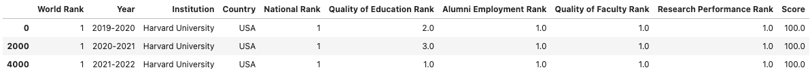
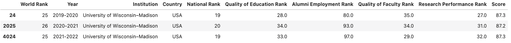
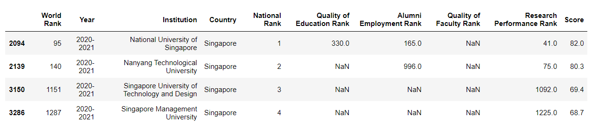

# Project 12: World University Rankings

## Clarifications/Corrections

None yet.

**Find any issues?** Report to us:

- Isha Padmanaban <ipadmanaban@wisc.edu>
- Rheeya Uppal <uppaal@wisc.edu>
- Lakshmi Nair <muraleedhara@wisc.edu>

## Learning Objectives

In this project, you will demonstrate your ability to:

- Read and write files
- Use a linter with your code
- Create and use Pandas DataFrames
- Use BeautifulSoup to parse web pages

## Coding Style Requirements

Remember that coding style matters! **We might deduct points for bad coding style.** Here are a list of coding style requirements:

- Do not use meaningless names for variables or functions (e.g. uuu = "my name").
- Do not leave irrelevant output or test code that we didn't ask for.
- Do not write the exact same code in multiple places. Instead, wrap this code into a function and call that function whenever the code should be used.
- Do not call unnecessary functions.
- Avoid calling slow functions multiple times within a loop.
- Avoid inappropriate use of data structures. For instance: do not use a `for` loop to search for a corresponding value in a dictionary with a given key; instead use `dictname[key]` directly.
- Do not name variables or functions as python keywords or built-in functions. Bad example: str = "23".
- Do not define multiple functions with the same name or define multiple versions of one function with different names. Just keep the best version.
- Put all `import` commands together at the second cell of `main.ipynb`, the first cell should be submission information (netid and etc).
- Do not use absolute paths such as `C://ms//cs220//p12`. **You may only use relative paths**. When we test your work on a different operating system, all of the tests will fail and you will get a 0. Don't panic when you see this, please fix the error and resubmit your assignment. Contact your TA if you need assistance with this task.
- **Avoid using loops to iterate over pandas dataframes and instead use boolean expressions**. More details are in the hints.

## Overview

For this project, you're going to analyze the world university rankings!

Specifically, you're going to use Pandas to analyze various statistics of the top ranked universities across the world, over the last three years.

To start, download and extract p12.zip, which will contain [`test.py`](https://github.com/msyamkumar/cs220-s22-projects/blob/main/p12/test.py), [`questions.py`](https://github.com/msyamkumar/cs220-s22-projects/blob/main/p12/questions.py), [`expected.html`](https://github.com/msyamkumar/cs220-s22-projects/blob/main/p12/expected.html), [`institutions.json`](https://github.com/msyamkumar/cs220-s22-projects/blob/main/p12/institutions.json), and [`lint.py`](https://github.com/msyamkumar/cs220-s22-projects/blob/main/p12/lint.py) (see linter documentation under "Testing" below). You'll do all your work in `main.ipynb`.

**Warning:** Do not download any of the other files manually (you must write Python code to
download these automatically, as in lab-p12). When we run the autograder, the other files such as [`rankings.json`](https://github.com/msyamkumar/cs220-s22-projects/blob/main/p12/rankings.json), [`2019-2020.html`](https://github.com/msyamkumar/cs220-s22-projects/blob/main/p12/2019-2020.html), [`2020-2021.html`](https://github.com/msyamkumar/cs220-s22-projects/blob/main/p12/2020-2021.html), [`2021-2022.html`](https://github.com/msyamkumar/cs220-s22-projects/blob/main/p12/2021-2022.html) will not be in the directory. So, unless your `main.ipynb` downloads these files, you will get a **zero score** on the project. More details can be found in the Setup section of the project.


# Data

For this project, we will be analyzing statistics about world university rankings adapted from
[here](https://cwur.org/). These are the specific webpages that we extracted the data from:

* https://cwur.org/2019-20.php
* https://cwur.org/2020-21.php
* https://cwur.org/2021-22.php

Later in the project, you will be scraping these webpages and extracting the data yourself. Since we
don't want all of you bombarding these webpages with requests, we have made *snapshots* of these
webpages, and hosted them on GitHub. You can find the snapshots here:

* https://github.com/msyamkumar/cs220-s22-projects/blob/main/p12/2019-2020.html
* https://github.com/msyamkumar/cs220-s22-projects/blob/main/p12/2020-2021.html
* https://github.com/msyamkumar/cs220-s22-projects/blob/main/p12/2021-2022.html

We will be extracting the data from these three html pages and analyzing them. However, to make it
a little easier for you to start, we have already done that for you! We have gathered the data from
these html files, and collected them in a single json file, which can be found here:

* https://github.com/msyamkumar/cs220-s22-projects/blob/main/p12/rankings.json

You will work with this json file for most of this project. However, at the end, you will
generate an identical json file by parsing the html files yourself.


# Testing

Just as a heads up, `test.py` will fail unless the required files mentioned above are downloaded. So if you plan to run test.py between questions, we recommend starting with the calls to `download`.

For answers involving a DataFrame, `test.py` compares your tables to
those in `expected.html`, so take a moment to open that file on a web browser (from Finder/Explorer).

`test.py` doesn't care if you have extra rows or columns, and it
doesn't care about the order of the rows or columns.  However, you
must have the correct values at each index/column location shown in
`expected.html`.

For p12, `test.py` is pickier than it has been. In addition to
checking for incorrect answers, it will also check for a few common
kinds of bad coding style. You should look for linting messages at the bottom
of the output, for example:

```
Linting Summary:
  Warning Messages:
    cell: 1, line: 4 - Redefining built-in 'id'
    cell: 1, line: 3 - Reimport 'numpy' (imported line 2)
    cell: 1, line: 5 - Unnecessary pass statement
    cell: 1, line: 2 - Unused import numpy
```

In this case, `test.py` will deduct 1 point per linter message because of
bad style, and at most deduct 10 points.

Please check out [lab-p12](https://github.com/msyamkumar/cs220-s22-projects/tree/main/lab-p12) to get a basic understanding of the linter. You can also look at this [README](https://github.com/msyamkumar/cs220-s22-projects/tree/main/linter).

# Setup

Add the following cell to the top of your notebook, and fill out the information:

```python
# project: p10
# submitter: NETID1
# partner: NETID2
# hours: ????
```

Only use the imports mentioned in lab-p12.

Copy / paste the `download` function from lab-p12. Use this function to pull the data from here (**do not manually download**): https://raw.githubusercontent.com/msyamkumar/cs220-s22-projects/main/p12/rankings.json
and store it in `rankings.json`. Once you have created the file, create a Dataframe `rankings` from this file.

**Warning**: Make sure your `download` function meets the specifications mentioned in lab-p12 and does not download the file if it already exists. The TAs will manually deduct points otherwise. Make sure you use `download` function to pull the data instead of manually downloading the files. Otherwise you will get a zero.

Once you have successfully downloaded `rankings.json`, you can open it with `pd.read_json('rankings.json')`.
The return value of pd.read_json needs to be explicitly cast to DataFrame for linting purposes.
This will return a DataFrame by reading from the json file. If the file contains lists of dictionaries,
each dictionary will be a row in the DataFrame.


## Questions

## WARNING: Use Boolean indexing of appropriate DataFrame to answer questions in this project. You will **lose points** during code review if you use conditional statements or loops. You are allowed to use .iloc for lookups. Using .loc is considered hardcoding and you will **lose points**.

### #Q1: How many countries do we have in our dataset?

Your output should be an **int** representing the number of unique countries in the dataset.

### #Q2: Generate a pandas DataFrame containing all the statistics of the highest-ranked institution based on "World Rank" (Note: highest rank is 1).

Your output should be a pandas **DataFrame** with 3 rows and 10 columns, and should look like this:



### #Q3: Generate a pandas DataFrame containing all the statistics of "University of Wisconsin–Madison".

Your output should be a pandas **DataFrame** with 3 rows and 10 columns, and should look like this:



**Requirement:**
- Store the answer to this question in a variable called uw_madison and use it for Q4 and Q5.

### #Q4: What is the "National Rank" of the "University of Wisconsin–Madison" in the year 2021-2022?

Your output should be an **int**.

**Requirements:**
- Use the variable uw_madison from Q3 to answer this question
- Use iloc to lookup the value (loc should not be used)

**Hint:** Apply Boolean indexing on the dataframe `(uw_madison)` to find the data for the year `"2021-2022"`. You may then extract the `"National Rank"` column from the subset DataFrame and use `iloc` to extract the actual rank.

### #Q5: What is the average score of the "University of Wisconsin–Madison"?

Your output should be a **float**.

**Requirement:**
- Use the variable uw_madison from Q3 to answer this question

**Hint:** You need to extract the `"Score"` column of the dataframe `(uw_madison)` as a Series. You can average all the scores in a Series with the `Series.mean()` function.

### #Q6: Generate a pandas dataframe containing all the statistics of universities from Singapore in the year 2020-2021.

Your output should be a pandas **DataFrame** with 4 rows and 10 columns, and should look like this:



**Hint:** When there are multiple conditions to filter a Dataframe, you can combine all the conditions with `&` as a logical operator between them. For example, you can extract the data for all the institutions with `Quality of Education Rank <= 10` and `Quality of Faculty Rank <= 10` with (usage of parenthesis is required):

```python
rankings[(rankings["Quality of Education Rank"] <= 10) & (rankings["Quality of Faculty Rank"] <= 10)]
```

### #Q7: In the year 2019-2020, what was the highest-ranked institution in Germany?

Your output should be a **str** representing the **name** of this institution.

**Requirements:**
- Store the entire row that contains the best German institution in a variable called `german_best`.
- Use iloc to lookup the value (loc should not be used)

**Hint:** The highest-ranked institution in Germany is the institution from Germany with a `National Rank` of 1.

### #Q8: In the year 2019-2020, list all the institutions in the USA ranked better than the highest-ranked institution in Germany.

Your output should be a **list** containing the **names** of all universities from USA with a better `World Rank` than the institution `german_best` in the year 2019-2020.

By *better ranked*, we refer to institutions with a lower value under the `“World Rank”` column.

**Requirements:**
- Use `german_best`, your answer from Q7. 

### #Q9: What is the highest-ranked institution based on “Quality of Education Rank” in China for the year 2021-2022?

Your output should be a **str** representing the **name** of this institution. You may assume there is only one institution satisfying these requirements.

By the *highest-ranked* institution, we refer to the
institution with the least value under the `“Quality of Education Rank”` column.

**Requirement:**
- Use iloc to lookup the value (loc should not be used)

**Hint:** You can find minimum value in a Series with the `Series.min()` method.
(You can find the documentation [here](https://pandas.pydata.org/pandas-docs/stable/reference/api/pandas.Series.min.html).)

[//]: # (You also have the option to use the .sort&#40;&#41; option as you have already done with lists.)

### #Q10: What are the top five highest-ranked institutions based on "Research Performance Rank" in India for the year 2020-2021?

Your output should be a **list** of institutions sorted in increasing order of their "Research Performance Rank".

**Hint:** For sorting a DataFrame based on the values of a particular column, you can use the `DataFrame.sort_values(by="column_name")` method (where "column_name" is the column on which you want to sort). You can find the documentation [here](https://pandas.pydata.org/pandas-docs/stable/reference/api/pandas.DataFrame.sort_values.html).

---

[//]: # (**Optional Challenge section:** For Q11 and the DataFrame that we will generate using Q11, there is a simpler &#40;but challenging&#41; solution. Please see the Optional **Optional Challenge:** section, for details about this.)

For the next few questions, we will be analyzing how the rankings of the institutions *change* across the three years in the dataset.
As you might have already noticed, the list of institutions in each year's rankings are different.
As a result, for several institutions in the dataset, we do not have the rankings for all three years. Since it will be hard to analyze such institutions, we will skip them.

### #Q11: How many institutions have rankings for all three years?

To get started, you can use the following code snippet:

```python
year_2019_ranking_df = rankings[rankings["Year"] == "2019-2020"]
year_2020_ranking_df = ???
year_2021_ranking_df = ???

# list containing names of institutions which have ranking for all three years
institution_2019_2020_2021 = ???
```
To calculate `institution_2019_2020_2021`, make sets of the institutions that appear in each DataFrame, and find their intersection.
(Look up how to find the intersection of two or more sets in Python, on the internet!)
Then, convert the intersected set back to a list.
Your output should be an int represeting the number of institutions which have data for all three years.

-----
**Data Structure Requirement**

Now, you are going to create a new DataFrame with a unique list of institutions which have featured in the rankings for all three years, along with their World Ranking across the three years.
Specifically, the DataFrame would have the following four columns - "Institution", "2019_ranking", "2020_ranking" and "2021_ranking".
To get started, you can use the following code snippet:

```python
institutions = []

for institution in institution_2019_2020_2021: # use your output list from Q11 here
    year_2019_ranking =  # TODO: use boolean indexing to find the "World Rank" for current institution in the year 2019
    year_2020_ranking =  # TODO: use boolean indexing to find the "World Rank" for current institution in the year 2020
    year_2021_ranking =  # TODO: use boolean indexing to find the "World Rank" for current institution in the year 2021

    # now let's create a dictionary representation of the institution
    # each key corresponds to the column of the DataFrame we want to build
    institution_info = {}
    institution_info['Institution'] = ???
    institution_info['2019_ranking'] = ???
    institution_info['2020_ranking'] = ???
    institution_info['2021_ranking'] = ???

    institutions.append(institution_info)

institutions_df = pd.DataFrame(institutions)
```

[//]: # (- Your output should be an **int** represeting the number of *institutions* which have data for all three years.)

[//]: # (**Optional Challenge:** A simpler solution can be using pandas `DataFrame.merge&#40;&#41;` method which, when called with argument `how = "inner"`, merges two dataframes based on a particular column considering only the intersection of row values in the two dataframes. For example, to merge the dataframes containing rankings of the year 2019-2020 and 2021-2022 based on the column "Institution" &#40;i.e., for unique institutions&#41; you can use merge method as follows:)

[//]: # ()
[//]: # (```python)

[//]: # (year_2019_ranking = rankings[rankings["Year"] == "2019-2020"][["World Rank", "Institution"]])

[//]: # (year_2020_ranking = rankings[rankings["Year"] == "2020-2021"][["World Rank", "Institution"]])

[//]: # (year_2021_ranking = pass # TODO: complete this)

[//]: # (institutions_df = year_2020_ranking.merge&#40;year_2019_ranking, how = 'inner', on = 'Institution'&#41; )

[//]: # (# TODO: merge institutions_df with year_2021_ranking)

[//]: # (# TODO: use rename function to rename columns)

[//]: # (```)

[//]: # (For more details, please have a look at the documentation of the `DataFrame.merge&#40;&#41;` method [here]&#40;https://pandas.pydata.org/pandas-docs/stable/reference/api/pandas.DataFrame.merge.html&#41;. After merging the DataFrames, you will also have to rename the columns to match the required answer. You can find the documentation for the `DataFrame.rename&#40;&#41;` method [here]&#40;https://pandas.pydata.org/pandas-docs/stable/reference/api/pandas.DataFrame.rename.html&#41;.)

[//]: # ()
[//]: # (**Warning:** You may create the DataFrame `institutions_df` however you like. However, if you do not create a DataFrame, you will **lose points** during code review.)

Please verify `institutions_df` by running the following code in its own cell. `institutions.json` was included in `p12.zip`:

```python
from test import verify_json
institutions_df.set_index('Institution').to_json('my_institutions.json')
assert verify_json('institutions.json', 'my_institutions.json') == "PASS"
os.remove('my_institutions.json')
```
You can delete this cell once the assert passes.


**Requirements:**
- Store the answer as a DataFrame in `institutions_df`.


<!---
```python
#Q11.5: Verifying institutions_df

# set_index function enables us to set any column in the DataFrame as row indices.
# to_json function enables us to convert the DataFrame into a JSON data structure.
institutions_df.set_index('Institution').to_json('my_institutions.json')
```
-->

### #Q12: Between the years 2019-2020 and 2021-2022, list the institutions which have seen an improvement in their "World Rank" by more than 500 ranks.

Your output should be a **list** of institution names. The order does not matter.

You should only compute the difference between the 2019 and 2021 ranking columns.

**Hint:** In pandas, subtraction of two columns can be simply done using subtraction(-) operator:

```python
df["difference"] = df["column1"] - df["column2"]
```
will create a *new column* `"difference"` with the difference of the values from the columns `"column1"` and `"column2"`.

**Requirements:**
- Your code should make use of `institutions_df` dataframe created in Q11.


[//]: # (### #Q13: Between the years 2019-2020 and 2021-2022, which institution has the most significant change in its "World Rank"?)
### #Q13: Between the years 2019-2020 and 2021-2022, which institution had the largest change in its "World Rank"?

Your output should be a **str** representing the name of the institution with the greatest absolute difference between its "World Rank" in 2019-2020 and 2021-2022.

**Hint:** You can find maximum value in a Series with the `Series.max()` method. You can find the documentation [here](https://pandas.pydata.org/pandas-docs/stable/reference/api/pandas.Series.max.html).

**Requirements:**
- Your code should make use of `institutions_df` dataframe created in Q11.
- Use .iloc for lookups. Using .loc is considered hardcoding and you will lose points for using it.

### #Q14: For all the three years, find the number of institutions that improved their `World Rank` each year.

Your output should be an **int**.

**Requirements** :
- Your code should make use of `institutions_df` dataframe created in Q11.

---

### #Q15: In the year 2020-2021, list the institutions which are within the top 10 in the world based on "Alumni Employment Rank" but do not feature in the top 10 of the world ranking.

 Your output should be a **list** of institutions. The order does not matter.

 **Requirement:**
- Use `sort_values` to identify the top 10 institutions
- Use the `year_2020_ranking_df` dataframe that you created in Q11

**Hint:**
- Given two *sets* `A` and `B`, you can find the elements which are in `A` but not in `B` using `A - B`. For example,
```python
set_A = {10, 20, 30, 40, 50}
set_B = {20, 40, 70}
set_A - set_B == {10, 30, 50} #Elements which are in set_A but not in set_B
```

### #Q16: List the universities which ranked in the top 100 of world rankings in the year 2019-2020 but failed to do so in the rankings of year 2021-2022.

Your output should be a **list** of institutions. The order does not matter.

**Requirement**
- Use .iloc for lookups. Using .loc is considered hardcoding and you will lose points for using it.
- Use the `year_2021_ranking_df` and `year_2019_ranking_df` dataframe that you created in Q11

**Hint:**
- Look for institutions which appear in the rankings of both years.
- There could be institutions that are ranked in the top 100 in `2019-2020` but do not feature in the year `2021-2022`; you still want to include it in your list.

---

### #Q17: List the countries which have at least 10 institutions featuring in the top 100 of world rankings in the year 2020-2021.

Your output should be a **list**.

**Hint:**
- In a DataFrame, to find the number of times each unique value in a column repeats, you can use the **DataFrame.value_counts** method.For example,

```python
rankings["Country"].value_counts()
```
would output a pandas **Series** with the indexes being the country names and value being the number of times each country has featured in the `rankings` DataFrame. You can find the documentation [here](https://pandas.pydata.org/pandas-docs/stable/reference/api/pandas.DataFrame.value_counts.html). You can adapt this code to find the number of institutions from each country that features in the year 2020-2021.

- You can extract indices of a Series `s`, by specifying `s.index`

---
## BeautifulSoup

### Setup

Very often, you don't have data in nice json format like `rankings.json`. Instead data needs to be scraped from multiple webpages and requires some cleanup.


This is a long but fun exercise where we will do the same by scraping these webpages.

* https://cwur.org/2021-22.php
* https://cwur.org/2020-21.php
* https://cwur.org/2019-20.php

Our `rankings.json` file was created using data from precisely these webpages. For the rest of this project, you will write the code to recreate `rankings.json` file from the tables in these html pages yourself!

For the remaining questions, you can use your code from Segment 4 of [lab-p12](https://github.com/msyamkumar/cs220-s22-projects/tree/main/lab-p12).

Make sure to import `BeautifulSoup` before you start working in this section!


Call the `download()` function to download

'https://raw.githubusercontent.com/msyamkumar/cs220-s22-projects/main/p12/2019-2020.html' as `'2019-2020.html'`

'https://raw.githubusercontent.com/msyamkumar/cs220-s22-projects/main/p12/2020-2021.html' as `'2020-2021.html'`

'https://raw.githubusercontent.com/msyamkumar/cs220-s22-projects/main/p12/2021-2022.html' as `'2021-2022.html'`


**Warning:** If you do not use the `download()` function to download these files, but instead download them manually, your code will crash on the autograder, and you will get a zero score.

---


### #Q18: Use BeautifulSoup to parse `2019-2020.html`, and find the table containing the ranking data. What are the column names of this table?

Your output should be a **list** of column names from this table.

**Hint**

-Use the  `.find()` or `.find_all()` methods to identify the table and its header.

- There are no restrictions on 'hardcoding' indices or html tags.

---

### #Q19: Parse the contents of the table you found in `2019-2020.html` and represent it as a list of dicts. What are the first 5 dictionaries in the list?

**Requirement**

- Use the `parse_html` function that you have created in lab-p12

There are no restrictions on 'hardcoding' html tags.

Your output should look like this.

```python
[{'Year': '2019-2020',
  'World Rank': 1,
  'Institution': 'Harvard University',
  'Country': 'USA',
  'National Rank': 1,
  'Quality of Education Rank': 2,
  'Alumni Employment Rank': 1,
  'Quality of Faculty Rank': 1,
  'Research Performance Rank': 1,
  'Score': 100},
 {'Year': '2019-2020',
  'World Rank': 2,
  'Institution': 'Massachusetts Institute of Technology',
  'Country': 'USA',
  'National Rank': 2,
  'Quality of Education Rank': 1,
  'Alumni Employment Rank': 10,
  'Quality of Faculty Rank': 2,
  'Research Performance Rank': 5,
  'Score': 96.7},
...]
```

---


### #Q20: Parse the contents of `2019-2020.html`, `2020-2021.html`, and `2021-2022.html` and combine them to create a file titled `my_rankings.json`.

The output of this question will be a **file** named `my_rankings.json` in your current directory.

Using the logic from the question above, combine the data from these three files into a single list of dicts, and write it into the file `"my_rankings.json"`. `test.py` will check to see if this file matches with `rankings.json`.

**Note:** You can use the `write_json` function that was introduced in lecture.

 ---

## IMPORTANT: Submission instructions

- Review the [grading rubric](https://github.com/msyamkumar/cs220-s22-projects/blob/main/p12/rubric.md), to ensure that you don't lose points during code review.
- Please remember to **`Kernel->Restart and Run All`** to check for errors, save your notebook, then run the **`test.py`** script one more time before submitting the project.
    - To keep your code concise, please remove your own testing code that does not influence the correctness of answers.
    - __If you are unable to solve a question and have partial code that is causing an error__ when running test.py, please __comment out the lines in the cell for that question.__ Failing to do so will cause the auto-grader to fail when you submit your file and give you 0 points even if you have some questions correctly answered.
    - Make sure that all the fields in the header cell are correctly populated, including **submitter** and **partner**.
    - Make sure that you have #q1, #q2, etc., as comments in the cells that answer each of the 20 questions.
- Follow the same steps as prior projects to turn in main.ipynb to the course website. If required, review those steps.
- It is **your responsibility to make sure that your project clears auto-grader tests on our testing system**.
  - Approximately 4 hours after you submit your program, auto-grader test results will become available. Make sure to use **View Submissions** to check the auto-grader test results.
  - We will not accept submissions after 7 days, even for autograder issues. This will result in a 0.
