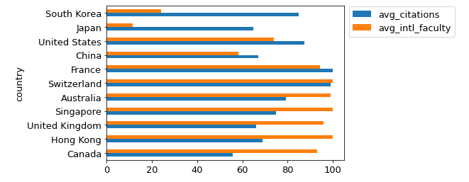

# Project 13: Databases and Plotting

<h2>Corrections/Clarifications </h2>

**Find any issues?** Report to us:  

- Saurabh <skulkarni27@wisc.edu>
- Joon <jhuh23@wisc.edu>
- Abhay <abhay.kumar@wisc.edu>

## Learning Objectives

In this project, you will demonstrate your ability to:

- Query a database using SQL
- Process data using Pandas DataFrames
- Create plots
- Write code with good style

## Coding Style Requirements

Remember that coding style matters! **We might deduct points for bad coding style.** Here are a list of coding style requirements:

- Use meaningful names for variables or functions.
- Do not write the exact same code in multiple places. Instead, wrap this code into a function and call that function whenever the code should be used.
- Do not call unnecessary functions.
- Avoid using slow functions multiple times within a loop.
- Avoid inappropriate use of data structures. A bad example: use for loop to search for a corresponding value in a dictionary with a given key instead of use `dictname[key]` directly.
- Don't name variables or functions as python keywords or built-in functions. Bad example: str = "23".
- Don't define multiple functions with the same name or define multiple versions of one function with different names. Just keep the best version.
- Put all `import` commands together at the second cell of `main.ipynb`, the first cell should be submission information (netid and etc).
- Don't use absolute path such as `C://ms//cs220//p13`. **You may only use relative path**. When we test your work on a different operating system, all of the test will fail and you will get a 0. Don't panic when you see this, please fix the error and resubmit your assignment. Contact your TA if you need assistance with this task.


# Testing

For answers involving a DataFrame, `test.py` compares your tables to those in `expected.html`, so take a moment to open that file in your browser.

`test.py` doesn't care if you have extra rows or columns, and it doesn't care about the order of the rows or columns.  However, you must have the correct values at each row/column location shown in `expected.html`.

For p13, `test.py` is pickier than it has been. In addition to checking for incorrect answers, it will also check for a few common instances of bad coding style. You should look for linting messages at the bottom of the output, for example:

```
Linting Summary:
  Warning Messages:
    cell: 1, line: 4 - Redefining built-in 'id'
    cell: 1, line: 3 - Reimport 'numpy' (imported line 2)
    cell: 1, line: 5 - Unnecessary pass statement
    cell: 1, line: 2 - Unused import numpy
```

In this case, `test.py` will deduct 1 point per linter message because of bad style, and at most deduct 10 points. For more information about the linter as well as how to run the full linter to see all of the automatically generated advice and feedback, please check out the [linting README](https://github.com/msyamkumar/cs220-s22-projects/tree/main/linter).

**Important**: Please make sure your linter works before you submit the project. If it's not working, please go to the office hours.

---

# Setup

To start, download and extract the `p13.zip` folder. It will create a p13 folder with all the files you need. You'll do all your work in `main.ipynb`.

Please add this header and fill out your information:

```python
# project: p13
# submitter: NETID1
# partner: NETID2
# hours: ????
```

**Warning:** Do not download the dataset `QSranking.json` manually. Use the `download` function from p12 to download it. When we run the autograder, this file [`QSranking.json`](https://github.com/msyamkumar/cs220-s22-projects/blob/main/p13/QSranking.json) will not be in the directory. So, unless your `main.ipynb` downloads this file, you will get a **zero score** on the project. Also, make sure your `download` function includes code to check if the file already exists. Otherwise, you will lose 5 points.

Once you have created the file, create a DataFrame named `rankings` from this file by using `pd.read_json('QSranking.json')`.  

You may use the following imports:

```python
import sqlite3
import pandas as pd
import matplotlib
from questions import verify_plot
import math
import numpy as np # this is for given code - do not use it yourself
```

In this project, you will be plotting graphs (similar to p9 and p11). Moreover, we will be dealing with many DataFrames. So, copy and paste these lines to one of the early cells in your notebook, to make your outputs more readable, and to pass `test.py`.

```python
# ensures that font.size setting remains permanent
%matplotlib inline
pd.set_option('display.max_colwidth', None)
matplotlib.rcParams["font.size"] = 13 # don't use value > 13! Otherwise your y-axis tick labels will be different.
```

---

# Plotting

In the lab, we either gave you or asked you to define the following functions:

```python
def bar_plot(df, x, y):
    pass

def scatter_plot(df, x, y):
    pass

def plot_horizontal_bar(df, x):
    pass

def plot_pie(df, x, y, title=None):
    pass

def get_regression_coeff(df, x, y):
    pass

def plot_regression_line(df, x, y):
    pass

```
Please copy them from your lab and paste them in your project notebook.

Along with it, we'll be giving you a function `verify_plot`, which will take in the same arguments as the plotting function, plus the question number.

```python
#<qnum>.1
verify_plot(qnum, df, x, y=None)
```

So for example, Q4 requires a bar plot, so you'd call

```python
#q4.1
verify_plot(4, top_10_countries, "country", "num_of_institutions")
```

Questions 16 requires a horizontal bar plot that doesn't take a y value.

```python
#q16.1
verify_plot(16, result_df, "country")
```

While `test.py` can verify the DataFrames you intend to plot, it cannot verify the images themselves. That will happen manually during code review.

**Troubleshooting**
- If you're getting an error like: `AttributeError: Can't get attribute '_unpickle_block' on <module 'pandas._libs.internals'...`  while you're importing `verify_plot`, please upgrade your pandas by executing `pip install --upgrade pandas==1.3.4` on your command line.

---


# Introduction

For your final CS220 project, you're going to continue analyzing world university rankings. However, we will be using a different dataset this time. The data for this project has been extracted from [here](https://www.topuniversities.com/university-rankings/world-university-rankings/2022). Unlike the CWUR rankings we used in p12, the QS rankings dataset has various scores for the universities, and not just the rankings. This makes the QS rankings dataset more suitable for plotting (which you will be doing a lot of!).

In this project, you'll have to dump your DataFrame to a SQLite database. You'll answer questions by doing queries on that database.  Often, your answers will be in the form of a plot. Check these carefully, as the tests only verify that a plot has been created, not that it looks correct (TAs will manually deduct points for plotting mistakes).

Create your database as you did in lab.

### WARNING:
You must write **SQL queries** to solve most of these questions. You will not get any credit if you use pandas operations to extract data. We will give you specific instructions for any questions where pandas operations are allowed.
---


### #Q1: Which 10 institutions in Canada had the highest number of international students in 2020?

You should display `institution_name` and `international_students`. The rows should be in *descending* order of `international_students`.

Your output should be a **DataFrame** that looks like this:


### #Q2: Which 10 institutions in the United States had the highest reputation in 2019?

The "reputation" is defined as the sum of `academic_reputation` and `employer_reputation`. Your output should have 2 columns: `institution_name` and `reputation`. Sort the institutions in *descending* order of `reputation`, then by institution names in *alphabetical* order.

Your output should be a **DataFrame** that looks like this:


### #Q3: Which 10 countries had the most institutions listed in the year 2020?

The columns displayed should be `country` and `num_of_institutions`. Your output should be in sorted in *descending* order of the number of institutions. Break ties by country names in *alphabetical* order.

Your output should be a **DataFrame** that looks like this:

  <br />


### #Q4: Plot the data from Q3 as a bar chart, along with the sum of all other countries' institutions.
#### #Q4.1 Verify your plot using `verify_plot`

You need to calculate the number of institutions in 2020 in all countries other than the top 10. You can do this using any combination of a SQL query **and pandas operations**.

*Hint:* You can use the `append` function of a DataFrame to add a single row to the *end* of your DataFrame from Q3. You'll also need the keyword argument `ignore_index=True`. E.g.

`my_new_dataframe = my_dataframe.append({"country": "CS220", "num_of_institutions": 22}, ignore_index=True)`

Ignore any warning about `append` being deprecated.

**Requirements:**
- Use the given `bar_plot` function
- Ensure that the x label is "country" and the y label is "num_of_institutions"
- Save the DataFrame you plot to a variable named `num_institutions`

Your image should look like this:


### #Q5: In 2019, what were the top 10 countries by total `overall_score`?

Your output should have 2 columns: `country` and `total_score`. The total score of a country is the sum of the overall scores of its institutions. Sort the countries in *descending* order of `total_score`.

**Requirements:**
- Save the answer to a variable named `top_total_score`

Your output should be a **DataFrame** that looks like this:


### #Q6: Plot the data from Q5 as a bar chart.
#### #Q6.1 Verify your plot using `verify_plot`

**Requirements:**:
- Use the given `bar_plot` function
- Use the `top_total_score` variable from Q5
- Ensure that the x label is "country" and the y label is "total_score"

Your image should look like this:


### #Q7: In the year 2020, what are the top 10 universities in the US with the biggest international score?

 The international score is defined as the sum of `international_faculty` and `international_students`. Your output should have 2 columns: `institution_name` and `international_score`. Sort the institutions in *descending* order of `international_score`.


Your output should be a **DataFrame** that looks like this:


---


### #Q8: In the year 2018, what is the relationship between `citations_per_faculty` and `overall_score`?
#### #Q8.1 Verify your plot using `verify_plot`

Create a DataFrame where one column is each institution’s `citations_per_faculty` and the other column is `overall_score`, then use `scatter_plot` function to generate a plot where each **institution** is represented as a point.

**Requirements:**
- Ensure that the x label is "citations_per_faculty" and the y label is "overall_score"
- Use the `scatter_plot` function


Your image should look like this:


### #Q9: In the year 2019, what is the relationship between `academic_reputation` and `employer_reputation` for institutions in the United States?
#### #Q9.1 Verify your plot using `verify_plot`

Create a DataFrame where one column is each institution’s `academic_reputation` and the other column is `employer_reputation`, then use `scatter_plot` function to generate a plot where each **institution** is represented as a point.

**Requirements:**
- Ensure that the x label is "academic_reputation" and the y label is "employer_reputation"
- Use the `scatter_plot` function

Your plot should look like this:


### #Q10: In the year 2020, what is the relationship between `international_students` and `faculty_student_score` for the top ranked institution in each country?
#### #Q10.1 Verify your plot using `verify_plot`

The **top** institution from each country is the institution with the least value of the `rank` column from that country. Use `scatter_plot` to generate a plot where each **country's top institution** is represented as a point.

**Requirements:**
- Ensure that the x label is "international_students" and the y label is "faculty_student_score"
- Use the `scatter_plot` function


**Hint:** You can use the `MIN()` SQL function to return the least value of a selected column.

Your image should look like this:


---

## Correlations

You can use `.corr()` on a dataframe that has two columns to get the correlation between those two columns.

If we have a Dataframe with columns `'citations_per_faculty'` and `'overall_score'`, `.corr()` would return:

| | citations_per_faculty | overall_score |
| --- | --- | --- |
| **citations_per_faculty** | 1.000000 | 0.574472 |
| **overall_score**	| 0.574472 | 1.000000 |

You can use `.loc` here to extract the desired value (0.574472) in this case. This applies to Q11 and Q12.


### #Q11: Find the correlation between `international_students` and `overall_score` for institutions in the 'United Kingdom' that were ranked in the top 100 in the year 2020. Perform the same calculation for institutions in the 'United States'. What is the difference between these two correlations?

Your output should be of **float** type representing the **absolute value** of the difference of the correlations.

To clarify, you should calculate two separate correlations - one for each of the two countries - then subtract them.

**Requirements:**
- The only pandas operations you may use are subtraction, `.corr`, `.loc` and `.iloc`
  - You should still use SQL to gather the necessary data

---

Let's define a new score called `citations_per_international` as `(citations_per_faculty * international_faculty) / 100`.

### #Q12: In the year 2019, what is the correlation between `citations_per_international` and `overall_score`?

Your output should be of **float** type representing the correlation between these quantities.

**Requirements:**
- The only pandas operations you may use are `.corr`, `.loc` and `.iloc`
  - You should still use SQL to gather the necessary data

---

### #Q13: In the year 2019, find the top 15 countries which have the highest total of `citations_per_international`.

Your output should be a **DataFrame** with the column `country` along with a *new column* `sum_intl_citations` representing the sum of  `citations_per_international` for all institutions in that country. The countries should be displayed in *descending* order of their `sum_intl_citations`.

*Hint:* The institutions need to be grouped by country.  

Your dataframe should look like this:\


### #Q14: In the year 2019, among the institutions ranked within the top 300, find the average of `citations_per_international` for each country.

Your output should be a **DataFrame** with the column `country` along with a *new column* `avg_intl_citations` representing the average of `citations_per_international` for each country. Sort the countries in *descending* order of their `avg_intl_citations`.

**Hint:** To find the average, you can use `SUM()` and `COUNT()` or you can simply use `AVG()`.

Your dataframe should look like this (the image is cropped):\


### #Q15: Find the institution with the highest value for `citations_per_international` for each country in the year 2020.

Your output should be a **DataFrame** with the columns `country`, `institution_name` and a *new column* `max_intl_citations` representing the maximum value of `citations_per_international` for that country. The countries should be displayed in *descending* order of `max_intl_citations`.

**Requirements:**

- Omit rows where `max_intl_citations` is missing using the clause ``HAVING `max_intl_citations` IS NOT NULL``

**Hint:** You can use the `MAX()` function to return the largest value within a group.

Your dataframe should look like this (the image is cropped):\


---

### #Q16: Among the institutions ranked within the top 50, generate a barplot visualizing the average of `citations_per_faculty` and `international_faculty` for each country in the year 2018.
#### #Q16.1: Verify your plot using `verify_plot`

You need to create a DataFrame with 3 columns: `country`, `avg_citations` and `avg_intl_faculty` representing the name, the average value of `citations_per_faculty` and the average value of `international_faculty` for each country respectively.

You need to answer with a **horizontal bar plot**. Put `country` on the y-axis and `avg_citations` and `avg_intl_faculty` on the x-axis. The countries should be ordered according to the difference between `avg_citations` and `avg_intl_faculty` . Use the appropriate ordering to match the shown graph.

**Requirements:**
- Use the `plot_horizontal_bar` function
- Ensure that the vertical axis is labeled as "country"
- Show a legend

Your image should look like this:



**Optional:** Finding a correct position for legend will take exploration for every plot. You can invoke `legend` function using AxesSubplot object instance. There are two configurable parameters: `loc` and `bbox_to_anchor`. You can read the [`legend()`](https://matplotlib.org/stable/api/_as_gen/matplotlib.pyplot.legend.html) documentation, to learn the details. In order to produce the above plot, we used the below settings:

```python
ax.legend(loc='center left', bbox_to_anchor=(1, 0.9))
```

If you haven't already, now is a good time to finish Task 3.5 in the lab. You'll need `get_regression_coeff(df, x, y)` and `plot_regression_line(df, x, y)`.

### #Q17: What is the relationship between `overall_score` and `rank` for all the institutions in the year 2020?
#### #Q17.1: Verify your answer using `verify_plot`

Your output should be a **scatter plot with a regression line** where each **institution** is represented as a point with `overall_score` on the x-axis and `rank` on the y-axis.

Your image should look like this:


*Does our linear regression model fit the points well? It looks like the relationship between the* `overall_score` *and* `rank` *is not quite linear. In fact, the relationship appears to be inverse.*

### #Q18: What is the relationship between  `1 / overall_score` and `rank` for all the institutions in the year 2020?
#### #Q18.1 Verify your plot using `verify_plot`

Your output should be a **scatter plot with a regression line** where each **institution** is represented as a point with `inverse_overall_score` on the x-axis and `rank` on the y-axis.

You may use a **pandas operation** to calculate `inverse_overall_score`.

Your image should look like this:


*This seems to be much better! Let us now use this regression line to estimate the* `rank` *of an institution given its* `overall_score`.

### #Q19: Use the regression line to estimate the rank of an institution with `overall_score` of 72.

Your output should be an **int**. If your estimate is a float, *round it up* using `math.ceil`.


**Hint:** Use the coefficients `m, b` that `get_regression_coeff` returns in Q18. You can make another call to `get_regression_coeff` if needed.
The equation of a line is `y = m * x + b`. What are `x` and `y` here?

*OPTIONAL: Can you find out the* `overall_score` *of the university with this* `rank` *in the year 2020? Does it match your prediction?*

---

### #Q20: What was the distribution of institutions in 2020 by country?
#### #Q20.1 Verify your plot using `verify_plot`
Show the top 10 countries, and group the remaining countries under "Other".

Your output should be a **pie chart**. The colors on the pie chart don't matter, but the chart should be titled `Number of institutions`, and should be labelled as in the sample output below.

**Requirements**:

- The title of the plot should be "Number of institutions"
- Make use of `num_institutions` from Q4 here.

Your image will look like this:


*OPTIONAL: It seems that we've run out of colors! How can we make it so that no two neighbors share a color? You'll probably have to look online.*

### WARNINGS:
### 1. **Close** the database connection in the last cell. Not doing this will make **autograder fail**. Please do this right away and save your precious time.
### 2. Make sure that you have written SQL queries to solve this project questions, you will not get any credit if you use the pandas DataFrame directly to answer questions!
### 3. Your plots should **exactly** match with the plots shown for the plotting questions. This includes the labels as well as the order in which the bars appear (in case of bar graphs).

---

## IMPORTANT: Submission instructions

- Review the [grading rubric](https://github.com/msyamkumar/cs220-s22-projects/blob/main/p13/rubric.md), to ensure that you don't lose points during code review.
- Please remember to **`Kernel->Restart and Run All`** to check for errors, save your notebook, then run the **`test.py`** script one more time before submitting the project.
    - To keep your code concise, please remove your own testing code that does not influence the correctness of answers.
    - __If you are unable to solve a question and have partial code that is causing an error__ when running test.py, please __comment out the lines in the cell for that question.__ Failing to do so will cause the auto-grader to fail when you submit your file and give you 0 points even if you have some questions correctly answered.
    - Make sure that all the fields in the header cell are correctly populated, including **submitter** and **partner**.
    - Make sure that you have #q1, #q2, etc., as comments in the cells that answer each of the 20 questions, plus #q4.1 etc. for the plot verification questions.
- Follow the same steps as prior projects to turn in main.ipynb to the course website. If required, review those steps.
- It is **your responsibility to make sure that your project clears auto-grader tests on our testing system**.
  - Approximately 4 hours after you submit your program, auto-grader test results will become available. Make sure to use **View Submissions** to check the auto-grader test results.  
  - We will not accept submissions after 7 days, even for autograder issues. This will result in a 0.
