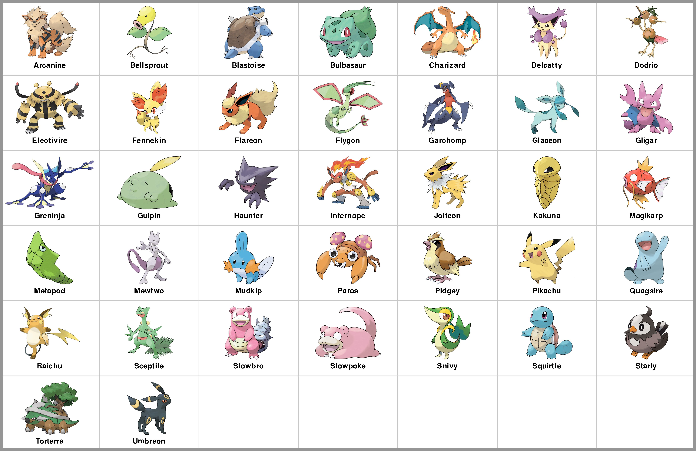

# Project 4: Pokémon Battle Simulation

### **Corrections and Clarifications**

- 10:00PM, 2/17: The writeup erroneously stated that no Pokémon has a second type of `'Bug'` or `'Fire'`. We are issuing a temporary correction (in the description of `luap_battle`) and will make a detailed announcemement on Piazza soon.

Find any issues? Report to us:

- Joon ([jhuh23@wisc.edu](mailto:jhuh23@wisc.edu))
- Abhay ([abhay.kumar@wisc.edu](mailto:abhay.kumar@wisc.edu))
- Yiwu ([yzhong52@wisc.edu](mailto:yzhong52@wisc.edu))

---

### **Learning Objectives**

In this project, you will demonstrate how to

- Use conditional statements to implement decisions
- Write functions using parameters, return values, and conditional logic
- Use good coding practices as outlined in Lab P4

Please go through [lab-p4](https://github.com/msyamkumar/cs220-s22-projects/tree/main/lab-p4) before working on this project. The lab introduces some useful techniques related to this project.

## **Overview**

For this project, you'll be using the data from `pokemon_stats.csv` and `type_effectiveness_stats.csv` to simulate Pokémon battles. This data was gathered by the Python program `gen_csv.ipynb` from the website [https://www.pokemondb.net/](https://www.pokemondb.net/).

- To start, download `project.py`, `questions.py`, `test.py`, `type_effectiveness_stats.csv`, and `pokemon_stats.csv`.
- You'll do your work in a Jupyter Notebook, producing a `main.ipynb` file.
- You'll test as usual by running `python test.py` to test your `main.ipynb` file.

We won't explain how to use the project module here (the code in the `project.py` file). The lab this week is designed to teach you how it works. So, before starting p4, take a look at [lab-p4](https://github.com/msyamkumar/cs220-s22-projects/tree/main/lab-p4).

This project consists of writing code to answer 20 questions. If you're answering a particular question in a cell in your notebook, you need to put a comment in the cell so we know what you're answering. For example, if you're answering question 13, the first line of your cell should start with `#q13` or `#Q13`.

In this project, you will have to write several functions and keep adding more details to them according to the instructions. When you are adding more things in your functions, we want you to follow the Good Coding Style for Functions described in [lab-p4](https://github.com/msyamkumar/cs220-s22-projects/tree/main/lab-p4). **Therefore, you should only keep the latest version of your functions in your notebook file.** For example, in p4 you are asked to write 6 functions(`damage`, `type_bonus`, `effective_damage`, `num_hits`, `battle`, and `luap_battle`), so there should only be one version of each of these 6 functions in your submitted notebook file.

The first cell should contain only contain information like this:
```python
# project: p4
# submitter: NETID1
# partner: NETID2
# hours: ????
```

**Note that**:

- You are only allowed to work with your named partner,
- you must name the person you worked with (by mentioning partner’s Netid in the above partner field), and
- **only one of you should submit your code.**

## **Questions and Functions**

In this project, we will be simulating Pokémon battles! Before we proceed any further, let us take a look at the Pokémon we will be dealing with, in this project:



Now, here are the *rules* governing Pokémon battles:

1. A Pokémon battle takes place between two Pokémon.
2. The two Pokémon take turns attacking each other.
3. The Pokémon with the higher Speed stat attacks first.
4. On each turn, the attacking Pokémon can choose between two modes of attack - Physical or Special.
5. In addition to the attack mode, each Pokémon can choose the type of its attack.
6. Based on the move chosen by the attacking Pokémon, the defending Pokémon receives damage to its HP.
7. If a Pokémon's HP drops to (or below) 0, it faints and therefore loses the battle.
8. However, if one Pokémon is much stronger than the other, then the weaker Pokémon will run away instead of fighting.

---

Whoa! There's a lot going on there! Throughout this project, we will break this down into smaller parts and slowly build-up to the `battle` function.

The first thing we need to do is calculate the damage caused by one Pokémon's attack on another Pokémon. To accomplish this, we need to create a function `damage(attacker, defender)`.

The `attacker` can choose between two attack modes - Physical or Special. The damage caused by the attacker's Physical move is `10 * Attack stat of Attacker / Defense stat of Defender`, and the damage caused by the attacker's Special move is `10 * Sp. Atk. stat of Attacker / Sp. Def. stat of Defender`.

**If the attacker wants to win, it should always choose the move which will do more damage.** So, that is what we want our function `damage` to do. We want this function to find out which mode of attack the attacker would choose, and return the damage that the attacker would do to the defender.

Copy/paste the following code in a new cell of your notebook and fill in the details.

```python3
def damage(attacker, defender):
    physical_damage = 10 * project.get_attack(attacker) / project.get_defense(defender)
    special_damage = ???
    if ???:
        return physical_damage
    else:
        return ???
```

Now, let's find out if this function works! Use `damage` to answer the next two questions.

### **#Q1: How much damage does Kakuna do to Paras?**

### **#Q2: How much damage does Delcatty do to Fennekin?**

---

In addition to choosing the attack *mode* (i.e. Physical or Special), the attacker can also (sometimes) choose the *type* of attack. Before we figure out what type the attacker should choose, we first need to find out the *effect* of the attack on the defender. Each attack type offers a *type bonus* to the attack damage that we calculated with the `damage` function.

If the attacker chooses an attack of type `attack_type` against a `defender` with only one type `type1` (i.e. its `type2` is "None"), then the type bonus of this attack is `get_type_effectiveness(attack_type, type1)`. If the `defender` has two types `type1` and `type2`, then the type bonus of this attack is `get_type_effectiveness(attack_type, type1) * get_type_effectiveness(attack_type, type2)`.

For example, let the `attack_type` be Fire and the defender be the Pokémon Squirtle. Squirtle has only one type, Water (with its `type2` being `"None"`). In this case, we see that

```python3
>>> project.get_type_effectiveness("Fire", "Water")
0.5
```

Therefore, the type bonus of a Fire-type attack on Squirtle is `0.5`. On the other hand, consider a Fire-type attack on the Pokémon Bulbasaur. Bulbasaur has 2 types, Grass and Poison. In this case, we see that

```python3
>>> project.get_type_effectiveness("Fire", "Grass")
2.0
>>> project.get_type_effectiveness("Fire", "Poison")
1.0
```

Therefore, the type bonus of a Fire type attack on Bulbasaur is the product of these two numbers and is therefore, `2.0 * 1.0 = 2.0`.

We are now ready to write the function `type_bonus`, which will calculate the type bonus of an `attack_type` against a `defender`. We've provided a code snippet for this function below:

```python3
def type_bonus(attack_type, defender):
    defender_type1 = ???
    defender_type2 = ???
    bonus = project.get_type_effectiveness(attack_type, defender_type1)
    if ???:
        ???
    return bonus
```

Use this function to answer the next two questions.

### **#Q3: How effective is Poison-type against Pikachu?**

### **#Q4: How effective is Water-type against Slowbro?**

---

When an `attacker` chooses an attack of type `attack_type` against a `defender`, the damage done is `type_bonus(attack_type, defender) * damage(attacker, defender)`.

An attacker can choose between any of its types for its attack type. So, if an attacker has two types, it can choose either Type 1 or Type 2 as its attack type. However, if it has only one type (i.e. its `type2` is `"None"`), it has no choice but to choose its Type 1 as its attack type. For example, a Pokémon like Weedle which has two types (Bug and Poison) can choose to make its attack either Bug-type or Poison type. On the other hand, a Pokémon like Magikarp which has only one type (Water) can only make its attack a Water-type attack.

While a Pokémon with only one type doesn't have a choice, a Pokémon with two types can choose between its two types. **if the attacker wants to win, it should always choose the type which will do more damage.**

Let us consider the case when an **attacker has only one type. (i.e. `type2` is 'None')**

To illustrate this, we take Magikarp as the attacker and Charizard as the defender. Let us first ensure that Magikarp has only 1 type.

```python3
>>> project.get_type1("Magikarp")
'Water'
>>> project.get_type2("Magikarp")
'None'
```

In this case, we simply take the `type_bonus` of the first type against Charizard (the defender).

```python3
>>> type_bonus(project.get_type1("Magikarp"), "Charizard")
2.0
>>> bonus = type_bonus(project.get_type1("Magikarp"), "Charizard")
```

`bonus` should contain the value `2.0`. To calculate the **effective damage** that Magikarp does to Charizard, we take `damage("Magikarp", "Charizard") * bonus`

```python3
>>> damage("Magikarp", "Charizard") * bonus
3.5294117647058822
```

We will now consider the case where an **attacker has two types**.

To illustrate this, we take Weedle as the attacker and Charizard as the defender. If your `type_bonus` function works correctly the values obtained by measuring the type bonus of Weedle against Charizard is

```python3
>>> type_bonus(project.get_type1("Weedle"), "Charizard")
0.25
>>> type_bonus(project.get_type2("Weedle"), "Charizard")
1.0
```

Clearly, Weedle's second type (Poison) causes more damage to Charizard than its first type (Bug). So, **Weedle would choose its Poison-type attack instead of its Bug-type attack against Charizard**.

Therefore, the effective `bonus` is `1.0`.

So, the **effective damage** that Weedle does to Charizard is `damage("Weedle", "Charizard") * bonus`

```python3
>>> bonus = max(type_bonus(project.get_type1("Weedle"), "Charizard"), type_bonus(project.get_type2("Weedle"), "Charizard"))
>>> bonus
1.0
>>> damage("Weedle", "Charizard") * bonus
4.487179487179487
```

We now write a function `effective_damage` to compute the actual damage that an attacker would do to the defender, taking into account, both the attack mode and attack type.

```python3
def effective_damage(attacker, defender):
    pass
    #TODO: check if attacker has two types; you must invoke the relevant function you defined in lab-p4
    #TODO: compute the bonus of attacker's type(s) against defender
    #TODO: find the attack_type with the higher bonus
    #TODO: compute the damage caused by attack, considering the higher bonus and return it
```

`effective_damage` function definition must invoke the `get_num_types` function you wrote during lab. 
Copy and paste it above your definition of `effective_damage`. **We'll manually deduct points** if you don't invoke `get_num_types`.   
Use the `effective_damage` function to answer the next three questions.

### **#Q5: How much damage does Pikachu do to Haunter?**

### **#Q6: How much damage does Quagsire do to Raichu?**

### **#Q7: How much damage does Slowpoke do to Gligar?**

---

Now that we have a way of calculating the damage done by the Pokémon during battle, we have to calculate how many hits each Pokémon can take before fainting.

The number of hits a Pokémon can take is calulated by taking its HP and dividing it by the attacking Pokémon's **effective damage**.

Note that if the defending pokemon has 30 HP and the attacking pokemon does 20 damage each turn, it will take 2 turns before the defender faints instead of 30 / 20 = 1.5. You might want to use the method math.ceil() here. First import the module math (remember to add the `import math` call at the top of your notebook) and then look up the documentation of math.ceil to see how you could use it.

Copy/paste the following code in a new cell of your notebook and fill in the details.

```python3
def num_hits(attacker, defender):
    return math.ceil(project.get_hp(???) / ???)
```

Use `num_hits` to answer the next two questions.

### **#Q8: How many hits can the defending pokemon Bulbasaur take from Flareon (attacker)?**

### **#Q9: How many hits can the defending pokemon Blastoise take from Charizard (attacker)?**

---

With the functions we have created so far, we can now finally start creating our battle simulator! Copy/paste the following code in a new cell of your notebook and fill in the details.

```python3
def battle(pkmn1, pkmn2):
    pass
    #TODO: Return the name of the pkmn that can take more hits from the other
    # pkmn. If both pkmn faint within the same number of moves, return the
    # string 'Draw'
```

Use `battle` to answer the next two questions.

### **#Q10: What is the output of battle('Bulbasaur', 'Flareon')?**

### **#Q11: What is the output of battle('Charizard', 'Blastoise')?**

You may have noticed that the function battle does not quite follow all the rules that we laid out at the beginning. The output of some battles might be a `'Draw'`, since they can both take the same number of hits from the other Pokémon. But if one pokemon has a higher speed, it attacks first. So, even though they both go down in the same number of moves, the one who attacks first should win the battle.

Go back and modify `battle` so that if both Pokémon faint in the same number of moves, the Pokémon with the higher Speed wins. If they both have the same Speed, then the battle should be a `'Draw'`.

Note: Do *not* redefine `battle`. The notebook you turn in should only have *one* definition of `battle`.
Similarly, do not define duplicate functions like "battlev2", "battle2" etc.


Use `battle` to answer the next two questions.

### **#Q12: What is the output of battle('Pidgey', 'Starly')?**

### **#Q13: What is the output of battle('Mudkip', 'Gulpin')?**

One last rule we need to implement is the runaway feature. For example, consider a battle between Pikachu and Glaceon. Glaceon can take 13 hits from Pikachu, but Pikachu can only take 2 hits from Glaceon. Because of this massive difference, Pikachu should choose to run away from this battle.

Modify battle so that if one Pokemon can take at least 10 more hits than the other, the one who is weaker runs away. The function should return `"<pkmn_name> ran away"`. Make sure the function says the Pokémon that can take fewer hits ran away!

Hint: Even though this is the last rule, it is the first thing that the battle function should determine. Also, here's another reminder to *not* redefine `battle`.

### **#Q14: What is the output of battle('Charizard', 'Bellsprout')?**

### **#Q15: What is the output of battle('Mewtwo', 'Pikachu')?**

### **#Q16: What is the output of battle('Slowpoke', 'Magikarp')?**

---
Some human trainers are too belligerent and willing to fight to win every Pokémon battle. Hence, many Pokémon battles are often unsafe and inhumane. One day, a group of Pokémon activists (who are Pokémons themselves!) against their tyrannical human partners formed the Labor Union & Association for Pokémons (LUAP). To ensure that every Pokémon battle is conducted under safe and humane conditions, the LUAP published the following guidelines:

1. Battles between `'Fire'` and `'Bug'` type Pokémons are inhumane, hence not allowed.
2. Battles between Pokémons from the same region can harm the biodiversity of that region, hence not allowed.

The above conditions can be summarized into a 'or' conditional as any battle that corresponds to either case 1) or 2) is forbidden. Write a new battle function named `luap_battle` by following the above LUAP guidelines and using the previous `battle` function. You may use the following template for `luap_battle`:

```python3
def luap_battle(pkmn1, pkmn2):
    pkmn1_type = project.get_type1(pkmn1)
    pkmn2_type = project.get_type1(pkmn2)
    #TODO: determine if Pokémons are from the same region; you must invoke the relevant function you defined in lab-p4
    if ???:
        ???
    # TODO: Return the output of battle(pkmn1, pkmn2) only when the battle follows the LUAP guidelines.
    # TODO: If it does not follow the guidelines, output "Forbidden".
```
`luap_battle` function definition must invoke the function `same_region`, which you defined in lab-p4 to determine whether Pokémon are from the same region. Copy and paste `same_region` before your definition of `luap_battle`. **We'll manually deduct points** if you don't invoke `same_region`.

Correction: A previous edition of this writeup said that there exist no Pokémon with `'Bug'` or `'Fire'` as a second type. For now, assume that `'Bug'` or `'Fire'` will never show up as a second type when we test `luap_battle`. Should this assumption change, we will issue an announcement on Piazza. Please look out for that.  

When the battle follows the LUAP guidlines, `luap_battle(pkmn1, pkmn2)` outputs the output of `battle(pkmn1, pkmn2)` else it outputs `Forbidden`. Please complete the `if` conditional in the above template then answer the following questions.


### **#Q17: What is the output of luap_battle('Paras', 'Arcanine')?**

### **#Q18: What is the output of luap_battle('Magby', 'Venomoth')?**

### **#Q19: What is the output of luap_battle('Electivire', 'Arcanine')?**

### **#Q20: What is the output of luap_battle('Flygon', 'Sceptile')?**

#### That will be all for now.

If you are interested, you can make your battle functions as complicated as you want. Here are some suggestions:

- You can prevent a battle between two Pokémon from two different regions (battle function simply could say `'Cannot battle'`). But wait, if either of those Pokémon have `Flying` type, then they should still be able to battle each other.
- You can simulate a 2 on 2 battle. If Pokémons from the same team win both battles, then that team wins. If one Pokémon from each team wins, then have another battle between them to determine the winning team.

We look forward to seeing the other fun functions you create!

------------------------------

## IMPORTANT: Submission instructions
- Review [Grading Rubric](https://github.com/msyamkumar/cs220-s22-projects/blob/main/p4/Rubric.md), to ensure that you don't lose points during code review.
- Please remember to **`Kernel->Restart and Run All`** to check for errors, save your notebook, then run the **`test.py`** script one more time before submitting the project.
    - To keep your code concise, please remove your own testing code that does not influence the correctness of answers.
    - __If you are unable to solve a question and have partial code that is causing an error__ when running test.py, please __comment out the lines in the cell for that question.__ Failing to do so will cause the auto-grader to fail when you submit your file and give you 0 points even if you have some questions correctly answered.
    - Make sure that all the fields in the header cell are correctly populated, including **submitter** and **partner**.
    - Make sure that you have #q1, #q2, etc., as comments in the cells that answer each of the 20 questions.
- Follow the same steps as prior projects to turn in main.ipynb to the course website. If required, review those steps.
- It is **your responsibility to make sure that your project clears auto-grader tests on our testing system**.
	- Approximately 4 hours after you submit your program, auto-grader test results will become available. Make sure to use **View Submissions** to check the auto-grader test results.

------------------------------
