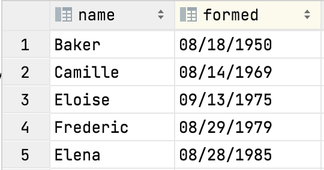

# Project 5: Hurricanes Study using Loops


## Corrections and clarifications

**Find any issues?** Report to us:

- Yiwu Zhong <yzhong52@wisc.edu>
- Rheeya Uppaal <uppaal@wisc.edu>
- Lakshmi Nair <muraleedhara@wisc.edu>

## Learning objectives

In this project, you will demonstrate how to

* write fundamental loop structures
* perform basic string manipulations
* create your own helper functions as outlined in
  [lab-p5](https://github.com/msyamkumar/cs220-s22-projects/tree/main/lab-p5)

**Please go through [lab-p5](https://github.com/msyamkumar/cs220-s22-projects/tree/main/lab-p5)
before working on this project.**
The lab introduces useful techniques related to this project.

## Overview

This project will focus on **loops** and **strings**.

Hurricanes often count among the worst natural disasters,
both in terms of monetary costs and, more importantly, human life.
Data Science can help us better understand these storms.
For example,
take a quick look at this FiveThirtyEight analysis by Maggie Koerth-Baker:
[Why We're Stuck With An Inadequate Hurricane Rating System](https://fivethirtyeight.com/features/why-were-stuck-with-an-inadequate-hurricane-rating-system/).

For this project, you'll be analyzing data in the `hurricanes.csv` file.
We generated this data file by writing a Python program
to extract stats from Wikipedia's
[List of United States hurricanes](https://en.wikipedia.org/wiki/List_of_United_States_hurricanes).
By the end of this semester, we'll teach you to extract data
from websites like Wikipedia for yourself.

We won't explain how to use the `project` module here
(the code in the `project.py` file).
The lab this week is designed to teach you how it works.

To start, download `project.py`, `questions.py`, `test.py` and `hurricanes.csv`.
You'll do your work in Jupyter Notebooks this week,
producing a `main.ipynb` file.
You'll test as usual by running `python test.py`
to test a `main.ipynb` file
(or `python test.py other.ipynb` to test a notebook with a different name).
If needed, you may only use standard Python modules such as `math`.
Please don't use `pip` to install any additional modules
as these are not considered standard modules. **You should not use concepts / modules that are yet to be covered in this course; for example: you should not use data structures like lists, dictionaries and modules like pandas.** We'll manually deduct points accordingly, if you don't follow the provided directions.

This project consists of writing code to answer 20 questions.
If you're answering a particular question in a cell in your notebook,
you need to put a comment in the cell so we know what you're answering.
For example, if you're answering question 13,
the first line of your cell should start with `#q13` or `#Q13`.

The first cell should contain only contain information like this:
```python
# project: p5
# submitter: NETID1
# partner: NETID2
# hours: ????
```

## Questions and functions

For the first three questions,
you don't have to define any functions of your own.
Instead you should just make use of the functions provided
in the file `project.py` by calling the corresponding function
that you need to solve a particular problem.

*Please note*, since indexing in python starts from 0,
for questions asking you to get a value at a particular **index**,
you should not confuse it with the actual **location**
of that value in the dataset. For example, consider this example from `hurricanes.csv`:



The **index** for the Hurricane Eloise is 2 but its actual **location** is 3.
Therefore, you must follow this convention for all the questions
asking for the value at a particular index.

### #Q1: How many hurricanes does the dataset have?

### #Q2: How many deaths were caused by the hurricane at index 138?

### #Q3: What is the MPH of the hurricane at the last index?

**Important:** Your code should work even if
the number of hurricanes in the dataset later changes. So, don't
**hardcode** the index of the last hurricane.

### #Q4: How many hurricanes named Sally are in the dataset?

Write your code such that it counts all potential variants
(e.g., "Sally", "SALLY", "SaLlY", etc.).

### #Q5: What is the fastest speed (in MPH) of a hurricane in the dataset?

**Hint:** Take a look at the section on finding the maximum/minimum from [lab-p5](https://github.com/msyamkumar/cs220-s22-projects/tree/main/lab-p5#5-finding-a-maximum-or-minimum).
Here, instead of maximizing over the function `f`, you will have to maximize
over the function `project.get_mph`.

### #Q6: What is the speed of the slowest hurricane (in MPH) recorded in the dataset?

### #Q7: What is the total damage (in dollars) caused by all hurricanes recorded in the dataset?

**Note**: Your answer should be in the form of an integer.

**Be careful!**
In the data, the number was formatted with a suffix (one out of "K", "M" or "B"),
so you'll need to do some processing to convert it.

Since you will need to format damages for future questions as well,
you should create a general helper function
that handles the "K", "M", and "B" suffixes (it will be handy later).
Remember that "K" stands for thousand, "M" stands for million,
and "B" stands for billion!
For example, your function should convert a string from "13.5M" to 13500000,
"6.9K" to 6900 and so on.

**Hint:** Use `float()` in the `format_damage` function for the numbers with
decimal points before multiplying by `1000`, `1,000,000` or `1,000,000,000`. Convert the final computation back into a `int` using `int()` function. That is your final return value from `format_damage` should be of type `int`.

```python
def format_damage(damage):
    #TODO: Check the last character of the string
    #TODO: Type cast the string (except for last character - use appropriate slicing) into float
    #TODO: Perform the conversion and type cast the final computation to int
    pass
```

### #Q8: What is the average damage caused by hurricanes with names starting with the letter G?

**Note:** Remember to search with 'G' and not 'g'. Round your answer to 2 decimal places.

### #Q9: What is the name of the fastest hurricane in the dataset?

**Important:** To break ties (multiple hurricanes with same speed),
you should consider the **first** one you find.

### #Q10: What is the damage (in dollars) caused by the fastest hurricane in the dataset?

**Important:** To break ties (multiple hurricanes with same speed),
you should consider the **first** one you find.

Your answer should be an integer. For example, your answer should be `1000000` instead of `1M`.

**Hint:** If you find the index of the hurricane which did the most
damage in Q9 instead of just the name of the hurricane,
you can solve Q10 very easily using the appropriate `project` module function (without writing a new loop).

### Q11: Out of all hurricanes with more than 1000 deaths, what is the name of the hurricane that originated (formed) first?

**Note:** You must copy the `get_month`, `get_day`, and `get_year`
functions you created in lab to your project notebook and use those functions. **We'll manually deduct points if you don't use those functions.**

**Note:** Use the year of hurricane formation to identify the oldest hurricane. To break ties (multiple hurricanes with the same formation year), you must consider the **last** one in the data set.  

---

### Function Suggestion:

We suggest you complete a function something like the following
to answer the next several questions
(this is **not** a requirement if you prefer to solve the problem another way):

```python
def deadliest_in_range(year1, year2):
    """
    Gets the index of the deadliest (most deaths) hurricane formed or dissipated within the given year range.
    year1 and year2 are inclusive bounds.

    Returns the ID of the worst hurricane within the year range.
    """
    pass
```

**Important:** By 'deadliest' we refer to the hurricane which causes the most deaths
(*not* the most damage).

### #Q12: How much damage was done by the deadliest hurricane this century thus far (2001 to 2022, inclusive)?

### #Q13: What was the speed (in MPH) of the deadliest hurricane in the century that spans 1901 to 2000, inclusive?

### #Q14: In this century (2001 to 2022, inclusive), which year has seen the deadliest hurricane so far?

**Note**: your answer should only be the year and not the full formation date.

---

### #Q15: What is the name of the slowest hurricane which resulted in exactly 5 deaths?

Just like other questions, you **cannot** hard code your answer.
If hurricanes were being added or removed to the `hurricanes.csv`, your code should still be correct.

To break ties (multiple hurricanes with the same mph), you must consider the **last** one in the data set.  

---

### Function Suggestion:

We suggest you complete a function something like the following to
answer the next several questions
(this is **not** a requirement if you prefer to solve the problem another way):

```python
def get_year_total(query_year):
    """Gets the number of hurricanes formed in the specified year"""
    pass    
```

### #Q16: How many hurricanes were formed in the year 2020?

### #Q17: How many hurricanes were formed in the last decade (2001 to 2010, inclusive)?

**Hint:** We suggest you complete a function like the following to
answer Q17. It will be of use later.
(this is **not** a requirement if you prefer to solve the problem another way):

```python
def get_decade_total(start_of_decade):
    """Gets the number of hurricanes formed in any year in the specified decade"""
    pass # TODO: invoke get_year_total appropriately
```

### #Q18: Which decade in the 20th century suffered the least number of hurricanes?
Your answer should be a string such as "1951 to 1960" or "1991 to 2000".

**Hints:** 

- You could use a `while` loop for iterating over decades or you can explore `range` built-in function further to determine how range can be used to generate sequence of start of the decades. 
- You could invoke `get_decade_total` function.

To break ties (multiple decades with the least number of hurricanes), you must consider the **last** one in the data set.  

---

### #Q19: How many deaths were caused by hurricanes that lasted across at least 2 different months?

**Hints:** 
- You can compare the month the hurricane formed and the month it dissipated and you can get the number of deaths using the get_deaths function. 
- Make sure that your conditional properly accounts for hurricanes that got formed in the previous year and got dissipated in the next year.

---

### #Q20: What is the name of the first hurricane to form after the dissipation of the deadliest hurricane between 1990 and 2010 (inclusive)?

**Important:** You may **not** assume that the hurricanes are in chronological order in the dataset.

**Hints:** 
- You **must use `get_number_of_days` function** that you defined in your lab. We'll manually deduct points, if you don't use this function.
- Remember that `get_number_of_days(start_date, end_date)` will be negative if `start_date` occurs after `end_date`. 
- Your job is to identify the index `idx` for which `get_number_of_days(deadliest_dissipation_date, project.get_formation(idx))` takes the smallest **positive** value.

------------------------------

## IMPORTANT: Submission instructions
- Review [Grading Rubric](https://github.com/msyamkumar/cs220-s22-projects/blob/main/p5/rubric.md), to ensure that you don't lose points during code review.
- Please remember to **`Kernel->Restart and Run All`** to check for errors, save your notebook, then run the **`test.py`** script one more time before submitting the project.
    - To keep your code concise, please remove your own testing code that does not influence the correctness of answers.
    - __If you are unable to solve a question and have partial code that is causing an error__ when running test.py, please __comment out the lines in the cell for that question.__ Failing to do so will cause the auto-grader to fail when you submit your file and give you 0 points even if you have some questions correctly answered.
    - Make sure that all the fields in the header cell are correctly populated, including **submitter** and **partner**.
    - Make sure that you have #q1, #q2, etc., as comments in the cells that answer each of the 20 questions.
- Follow the same steps as prior projects to turn in main.ipynb to the course website. If required, review those steps.
- It is **your responsibility to make sure that your project clears auto-grader tests on our testing system**.
	- Approximately 4 hours after you submit your program, auto-grader test results will become available. Make sure to use **View Submissions** to check the auto-grader test results.

------------------------------
