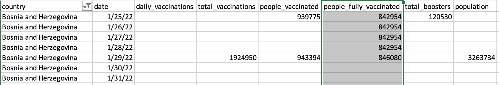
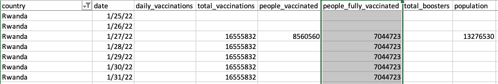

# Project 7: COVID-19 Vaccination


## Corrections & Clarifications

**Find any issues?** Report to us,

* Lakshmi (<muraleedhara@wisc.edu>)
* Abhay (<abhay.kumar@wisc.edu>)
* Joon (<jhuh23@wisc.edu>)


### Learning objectives

 In this project, you will

* Demonstrate how to write programs to interpret data present in csv files;
* Demonstrate how to organize real-world data with missing entries;
* Demonstrate how to use dictionaries effectively to manage data;
* **Develop good coding styling habits (points may be deducted for bad coding styles)**.


## Intro

Let's track COVID-19 vaccination, Python style!  In this project, you will get more practice with lists and start using dictionaries. Start by downloading `test.py` and `vaccinations.csv` (which was adapted from [this dataset](https://ourworldindata.org/covid-vaccinations)). This dataset is too large to preview on GitHub (>55K rows), but you can view the [raw version](https://raw.githubusercontent.com/msyamkumar/cs220-s22-projects/main/p7/raw_covid_data.csv) or using a program such as [Excel](https://github.com/msyamkumar/cs220-s22-projects/blob/main/p7/excel.md). For this project, you'll create a new `main.ipynb` and answer questions in the usual format. **Please go through the [Lab-P7](https://github.com/msyamkumar/cs220-s22-projects/tree/main/lab-p7) before working on this project.** The lab will introduce some useful techniques related to this project.

### Coding style requirements

* Don't name the variables and functions as Python keywords or built-in functions. Bad example: str = "23".
* Don't define functions with the same name or define one function multiple times. Just keep the best version.
* Please put the 4-line submission information in the first cell of `main.ipynb`.
* Put all `import` commands together at the second cell of `main.ipynb`.
* Please don't import any modules that we didn't ask you to import, **TAs will deduct points for additional imports.**


## The Data

Refer back to the lab7 [`practice.ipynb`](https://github.com/msyamkumar/cs220-s22-projects/tree/main/lab-p7/practice.ipynb), for description about the dataset.

**Important Note:** You may assume for this project, that the dates are all sorted in increasing order in the dataset. In other words, the dates appear in the order of 01/25/2022 to 01/31/2022. Moreover, you may assume that the data is grouped by the countries. So, all the data for one country appears together, followed by the data for another country, and so on, just as in `vaccinations.csv`.

## Let's Start!

**Important Warnings:**
- Do **not** hardcode the column indices anywhere in your code. You will **lose points** during code review if you do so. Instead, use `.index()` as you did in P6.
- You should not use concepts / modules that are yet to be covered in this course; for example: you should not use modules like pandas. **We'll manually deduct points** accordingly, if you don't follow the provided directions.

The first cell should contain only contain information like this:
```python
# project: p7
# submitter: NETID1
# partner: NETID2
# hours: ????
```
All import statements should be in the second cell. **You will also need to read in the CSV data; use the cells that we made in [lab-p7](https://github.com/msyamkumar/cs220-s22-projects/tree/main/lab-p7) to do so.** Make sure to copy/paste the `cell` function definition. Complete this before q1.


### #Q1: What dates are mentioned in the dataset?

Your answer should be a `list` of the unique dates in the dataset. The list does not have to be sorted.

**Requirement:** Save this `list` to a variable. You will use it for Q6.

---
### #Q2: What countries are listed in the dataset?
Your answer should be a `list` of the countries in the dataset. The list should be sorted in alphabetical order.

---

### #Q3: What is the population of each country in the dataset?

Your answer should be a `dict` mapping each country to its population.

Notice that population data is present only on (at most) one row for each country.  Once you find the population for a country, store it in your dictionary.

**Warning:** We do not have population data for some countries. Such countries should appear in your `dict` with the value `None`.

**Requirement:** Save this `dict` to a variable. You will use it for Q11.

---

Now, let us focus on the `daily_vaccinations` column. We now have to decide how to deal with the missing data in this column. We have several choices ahead of us. For instance, we could perform linear interpolation using the available data to estimate the `daily_vaccinations` when the data is missing. However, given the nature of the dataset, let us err on the side of caution. If the `daily_vaccinations` data is missing for a certain date, **we will ignore that date**. In effect, we make the conservative estimate that the number of vaccinations on that date is 0.

### #Q4: How many countries have an entry for daily vaccination on Jan 28, 2022?

Your answer should be an `int`.

---

### Function requirement:

We will now create a function `daily_vaccinations_on` to deal with the missing data in the `daily_vaccinations` column. Note that when the data is missing for a certain date, we want the value to be `None`.

**Note**: Implementing this function is **required**, and you will **lose points** if you do not implement `daily_vaccinations_on`.

**Hint**: Take a look at the answer to Q5 for an idea of what your dictionary should look like.

```python
def daily_vaccinations_on(search_date):
    '''return a dictionary mapping each country to
    the number of daily vaccinations on the given date;
    if data is missing, the value for that country is None'''

```

### #Q5: For each country, how many vaccinations were given on Jan 31, 2022?

Your answer should be a `dict` mapping each country to the number of vaccinations done on Jan 31 in the country. If no data is available for a country on that date, the value should be `None`.

**Requirement:** You must use `daily_vaccinations_on` function that you implemented.


### #Q6: For each country, what is the sum of the vaccinations given on all of the dates mentioned in the dataset?

Your answer should be a `dict` mapping each country name to the sum of the daily vaccinations done in that country during the dates mentioned in the dataset. Within a country's data, not all days will have vaccination records. Add up the reported vaccination counts only. For a country with no data at all, the value should be `None`.

**Requirements:**
- Do not hardcode the dates in the dataset. You must use the list of dates you produced in Q1.
- You must use `daily_vaccinations_on` function that you implemented.
- Save the answer to this question to a variable. You must use this dictionary to answer Q7.


### #Q7: Which country completed the most number of vaccinations during the dates mentioned in the dataset?

**Requirement**: You must use the dictionary you created in Q6. Do not recreate it.

**Note:** Ignore the countries with no data.

---

### #Q8: How many vaccinations (across the world) were given on each date?

Your answer should be a `dict` mapping each date to the total number of vaccinations done on that date across the world. Use the `daily_vaccinations` column.

There is no function requirement for this question, besides `cell` to access the data.

**Hint:** you need not use Q1's list to answer this question. You can populate this dictionary just by iterating over the entire dataset.

---
### #Q9: For each country in the dataset, when is the last date for which we have information about the number of fully vaccinated people?

Your answer should be a **dict** mapping each country to the last date for which the `people_fully_vaccinated` data is not missing. For countries that have data missing on all seven days, the value should be `None`.

For example, for Bosnia and Herzegovina, data is available only for Jan 29, 2022, and is missing for all other days. In this case, the value of the key `'Bosnia and Herzegovina'` should be `'01/29/2022'`, since that is the last day for which the record is available.


---
<!---
### Function suggestion:

We will now create a function `fully_vaccinated_by` to deal with the missing data in the `people_fully_vaccinated` column. Whenever the `people_fully_vaccinated` record is missing on a certain date, we will use the most recent record from before that date.  If no prior record is available on or before a certain date, we will say the value is `None`.



For example, for Bosnia and Herzegovina, the data is missing from **Jan 30**. So, for **Jan 30 to Jan 31**, we will use the data from **Jan 29** which is the most recent day before **Jan 30**.



For other countries such as Rwanda, the data is only available on and after **Jan 27**. However, for **Jan 25 to Jan 26**, we don't have any information available. Therefore, we will set the values to `None` for **Jan 25 to Jan 26**.

Note that this function is a **requirement**, and you will **lose points** if you do not implement this function.

```python
def fully_vaccinated_by(given_date):
    '''return a dictionary mapping each country to the most recent number of people
    fully vaccinated by the given date; if no data is available, the value is None.'''
    fully_vax_dict = ???
    for i in range(???):
        country = ???
        date = ???
        fully_vax = ???
        if country not in fully_vax_dict:
            fully_vax_dict[???] = ???
	if fully_vax is the empty string:
	    ???
        if date is on or before given_date
            fully_vax_dict[country] = fully_vax
    return ???
```
--->


### #Q10: How many people were estimated to be fully vaccinated in each country, as of 31 Jan 2022?

Your answer should be a **dict** mapping each country to the best available estimate of the number of fully vaccinated people as of '01/31/2022'. If we have no estimate for a certain country, the value for that country should be `None`.

**Requirements:**
- You must use `most_recent_total` function used in Task 3.2 of [Lab-P7](https://github.com/msyamkumar/cs220-s22-projects/tree/main/lab-p7) to solve this question.
- Save this `dict` to a variable. You will use it for Q11.

<!---
This is covered by the lab
**Hint:** In order to check if any particular date is before another date, recall that you can use `get_number_of_days` from p5. `get_number_of_days(date1, date2)` will be positive, if `date1` is before `date2`. Of course, you may do this through other means if you wish. (You are allowed to import the `datetime` module).
--->

---

### #Q11: Among countries with population less than 100 million, which country is estimated to have had the highest number of fully vaccinated people by 31 Jan 2022?

**Requirement:**  Use the `dict` variables from Q10 and Q3, to answer this question.

**Note:** You should ignore countries for which the `population` data is missing.

----

### Dictionary of Dictionaries:

In data science, a lot of questions can be answered with short lines of code, if we first organize our data in an easily accessible data structure. We will now try to do exactly that.

We will create a **dictionary of dictionaries** called `vaccination_stats` to store our data. Note that this data structure is a **requirement**, and you will **lose points** if you do not implement this data structure. The keys of this dictionary will be the various countries in the dataset (which you found in Q2), and the value corresponding to each key will be another dictionary. As for the inner dictionary, the keys will be the different dates (which you found in Q1), and the value will be a dictionary representing all the records (available) of that country on that date.


To reiterate, `vaccination_stats` should be a dictionary where the keys are `country` names. The values should be dictionaries with the keys being the different `date`. The values of these keys should be dictionaries like the one below.

```python
>>> vaccination_stats['Albania']['01/30/22']
{'country': 'Albania',
 'date': '01/30/22',
 'daily_vaccinations': 'None',
 'total_vaccinations': 2523683,
 'people_vaccinated': 1210040,
 'people_fully_vaccinated': 1111520,
 'total_boosters': 202123,
 'population': 2873046}

```

You can start with this code snippet if you want:

```python
vaccination_stats = {}

for date in dates:
    daily_vax_dict = ??? # a dict mapping each country to number of daily_vaccinations on date
    total_vax_dict = ??? # a dict mapping each country to the most recent number of total_vaccinations on date
    people_vax_dict = ??? # a dict mapping each country to the most recent number of people_vaccinated on date
    fully_vax_dict = ??? # a dict mapping each country to most recent number of people_fully_vaccinated on date
    total_booster_dict = ??? # a dict mapping each country to most recent number of total_boosters on date
    for country in countries:
        if country not in vaccination_stats:
            vaccination_stats[country] = {}
        vaccination_stats[country][date] = {}
        vaccination_stats[country][date]['country'] = country
        vaccination_stats[country][date]['date'] = date
        # TODO: fill in the rest of the dict to match the example above
```

The lists `dates` and `countries` can be found from your answers to Q1 and Q2 respectively. The population for each country can be found from your answer to Q3.

**Requirements:**
- Use `daily_vaccinations_on` function to initialize `daily_vax_dict`.
- Use `most_recent_total` function to initialize `total_vax_dict`, `people_vax_dict`, `fully_vax_dict`, and total_booster_dict.  


### #Q12: What are the vaccination records for the United States on 31 Jan 2022?

**Requirement:** Use `vaccination_stats` dictionary to answer this question.


### #Q13: What are the vaccination records for Argentina on 25 Jan 2022?

**Requirement:** Use `vaccination_stats` dictionary to answer this question.


### #Q14: What are the vaccination records for Belgium on 27 Jan 2022?

**Requirement:** Use `vaccination_stats` dictionary to answer this question.

---

### #Q15: What are the vaccination records for the country with the highest `population` in the dataset on 29 Jan 2022?

**Note:** Ignore countries for which population data are missing.

**Requirement:** Use `vaccination_stats` and the dictionary you created in Q3 to extract all the data you need for this question.

---

### #Q16: What is the estimated ratio of people who have been partly vaccinated to people who have been fully vaccinated in each country, as of Jan 31, 2022?

Your answer should be a **dict** mapping each country to the ratio. If the ratio cannot be computed for some country due to missing data, the value of that country should be `None`.

**Requirement:** Use `vaccination_stats` to extract all the data you need for this question.

**Hint:** The `people_fully_vaccinated` column contains data about the number of people who have been fully vaccinated. The `people_vaccinated` column contains the sum of the number of people who have been fully vaccinated and the number of people who are partially vaccinated.

---

### #Q17: Which country has administered the most number of booster shots as of Jan 31, 2022

**Requirement:** Use `vaccination_stats` to extract all the data you need for this question.

---

### #Q18: Which country is estimated to have administered the most number of booster shots per capita, as of 25 Jan 2022?

**Requirement:** Use `vaccination_stats` to extract all the data you need for this question.

**Hint:** The number of booster shots per capita is `total_boosters / population`

---

### #Q19: What is the percentage of population boosted by Jan 31, 2022 of each country in the dataset?

Your answer should be a `dict` mapping each country to the percentage of population boosted by the end of the week. For countries that have no data for `total_boosters` or `population`, the value should be `None`.

**Requirements:**
- Use the data structure `vaccination_stats` to extract all the data you need for this question.
- Save this dictionary to a variable. You will use it in Q20.

**Hint:** The percentage of population boosted is `(total_boosters / population) * 100`

---

### #Q20: Among all the countries in the dataset, what is the rank of Canada's percentage of population boosted?

The expected answer is an `int` that represents the rank (e.g., 3 for 3rd, with 1 being the highest). Do not hardcode anything except for the name of the country.

**Requirements:**
- Use the data structure `vaccination_stats` to extract all the data you need for this question.
- You **are not allowed** to use `sorted()` or `.sort()` in this problem.
- Use the `dict` data structure from Q19. You must iterate over the entire `dict`, to compute the rank.

------------------------------

## IMPORTANT: Submission instructions
- Review [Grading Rubric](https://github.com/msyamkumar/cs220-s22-projects/blob/main/p7/rubric.md), to ensure that you don't lose points during code review.
- Please remember to **`Kernel->Restart and Run All`** to check for errors, save your notebook, then run the **`test.py`** script one more time before submitting the project.
    - To keep your code concise, please remove your own testing code that does not influence the correctness of answers.
    - __If you are unable to solve a question and have partial code that is causing an error__ when running test.py, please __comment out the lines in the cell for that question.__ Failing to do so will cause the auto-grader to fail when you submit your file and give you 0 points even if you have some questions correctly answered.
    - Make sure that all the fields in the header cell are correctly populated, including **submitter** and **partner**.
    - Make sure that you have #q1, #q2, etc., as comments in the cells that answer each of the 20 questions.
- Follow the same steps as prior projects to turn in main.ipynb to the course website. If required, review those steps.
- It is **your responsibility to make sure that your project clears auto-grader tests on our testing system**.
	- Approximately 4 hours after you submit your program, auto-grader test results will become available. Make sure to use **View Submissions** to check the auto-grader test results.

------------------------------
