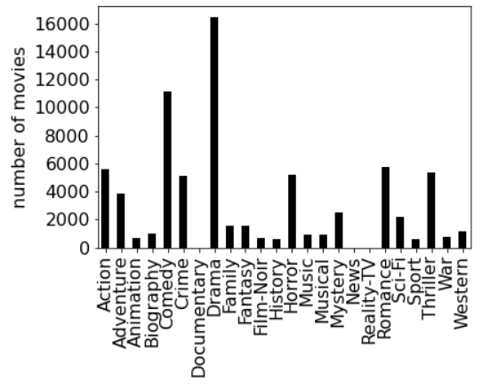
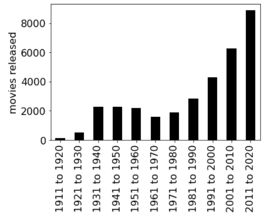
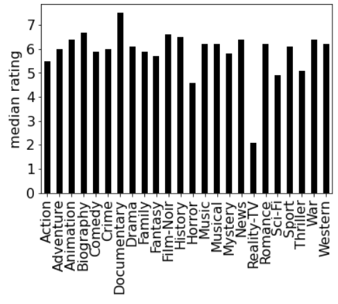

## Project 9: Analyzing the Movies

## Clarifications/Corrections


**Find any issues?** Report to us:  

- Abhay [abhay.kumar@wisc.edu](mailto:abhay.kumar@wisc.edu)
- Joon [jhuh23@wisc.edu](mailto:jhuh23@wisc.edu)
- Lakshmi [muraleedhara@wisc.edu](mailto:muraleedhara@wisc.edu)

## Learning Objectives

In this project, you will demonstrate your ability to:
- Use `matplotlib` to plot bar graphs and visualize statistics
- Process data using dictionaries and lists that you build
- Implement binning by writing algorithms that create dictionaries
<!-- Custom sort a list using the keyword argument `key`-->
- Custom sort a list using the keyword parameter key's argument.

## General Requirements

Remember that coding style matters! **Points may be deducted for bad coding style.** Please also refer to [Requirements in P8](https://github.com/msyamkumar/cs220-s22-projects/tree/main/p8#coding-style-requirements).

**Allowed**: You are allowed to use comprehensions, since we covered them in the "Comprehensions" lecture.

**Not Allowed**:
- Please do not use the method `csv.DictReader` for P9. Although the required output can be obtained using this method, one of the learning outcomes of this project is to demonstrate your ability to build dictionaries with your own code.
- Although you will need to import `matplotlib` and `pandas` to make plots, you may not use these modules for any other purposes.  Instead, you will build custom lists and dictionaries through algorithms, and sort them using the skills you learned in lecture and in Lab-P9. `numpy` is not allowed to be imported.

**Warning**: For the questions asking you to plot, our `test.py` is unable to check whether your plot is correct. So make sure you **manually compare** your plots with the expected plots before submitting your notebook. Please make sure that you **do not modify** the original movies list.

## Introduction

In P8, you created very useful helper functions to parse the raw IMDb dataset. In this project, you will be using the work you did in P8 to load and analyze the data.

- Start by downloading the following files: [`test.py`](https://github.com/msyamkumar/cs220-s22-projects/blob/main/p9/test.py), [`mapping.csv`](https://github.com/msyamkumar/cs220-s22-projects/blob/main/p8/mapping.csv), and [`movies.csv`](https://github.com/msyamkumar/cs220-s22-projects/blob/main/p8/movies.csv) (Click file names to download).

- For the **first cell**, please copy & paste the below and replace NETID1, NETID2 with your and your partner's NetID.

```python
# project: p9
# submitter: NETID1
# partner: NETID2
# hours: ????
```

- In `main.ipynb`, make sure to include a new cell with the following code.  These are the **only** import statements you are allowed to use on this project.

```python
import csv
import matplotlib
import pandas

# Allows you to render matplotlib graphs in the same notebook
%matplotlib inline
```

- [**Lab-P9**](https://github.com/msyamkumar/cs220-s22-projects/tree/main/lab-p9) goes over the installation and the basic usage of `matplotlib` and `pandas`.

- Then, copy over the functions `plot_dict`, `median` and `year_to_decade` from [**Lab-P9**](https://github.com/msyamkumar/cs220-s22-projects/tree/main/lab-p9).

- Finally, copy the functions you wrote from P8 to `main.ipynb`. As a reminder, the functions you should include are `process_csv`, `get_mapping`, `get_raw_movies`, `get_movies`  along with any helper functions you used to write these.

- In Q14 of [**P8**](https://github.com/msyamkumar/cs220-s22-projects/blob/main/p8/), you used `copy` module to pass a copy of a list to `find_specific_movies`. This prevented the list from being modified by `find_specific_movies`. However, using `copy` frequently is not a good coding practice. For this project, we will provide **a new version** of `find_specific_movies` that does not require `copy`. Please copy & paste the following into your notebook:

```python
def find_specific_movies(movies, keyword):
    '''given a list of movie dictionaries and a keyword,
    returns a list of movies that contains the keyword'''
    movies_new = list()
    for movie in movies:
        if (keyword in movie['title']) or (keyword in movie['genres']) \
            or (keyword in movie['directors']) or (keyword in movie['actors']):
            movies_new.append(movie)
    return movies_new
```

### Let's get started!

## Analyzing the Movie Data

For all these questions, we will be looking at the movies in `mapping.csv` and `movies.csv`. You can load the list of movies using the function
you wrote in the last project (Note you should only have to do this once):

```python
movies = get_movies("movies.csv", "mapping.csv")
```
<!---This will result in a list of movies, which we can loop over and answer interesting questions about.--->
The first entry of `movies` should be a dictionary that looks as follows:

```python
{'title': 'They Live',
 'year': 1988,
 'genres': ['Action', 'Horror', 'Sci-Fi'],
 'duration': 94,
 'directors': ['John Carpenter'],
 'actors': ['Roddy Piper', 'Keith David', 'Meg Foster'],
 'rating': 7.3}
```
**Requirement:** Your function should order the movies in the same order as they are in `movies.csv`. For all questions in this project, whenever you are asked to return **a list of movies**, the list should be **in the order of** `movies.csv`, **unless it is explicitly mentioned otherwise**.

**Warning:** At this stage, it is expected that the function `get_movies` works correctly, and passes all of the tests in P8. If not, your code will run into issues in P9. So, make sure that this function works properly before you start P9.

---

The first few questions can be answered using functions from P8. They should help you familiarize yourself with the data and understand how to traverse it with loops.

### #Q1: What is the average rating of the 'Harry Potter' movies directed by 'David Yates'?

**Requirements:**
- Use the new `find_specific_movies` we gave you to solve this problem.
- 'Harry Potter' movies are movies whose titles contain 'Harry Potter'. You can safely assume 'Harry Potter' only appears in movie titles and 'David Yates' only appears in movie directors.

**Hint:** Not all 'Harry Potter' movies are directed by 'David Yates'.

### #Q2: What is the median rating of all 'Ice Age' movies?

**Requirements:**
- Use the median function you wrote in Lab-P9.
- Use `find_specific_movies` to solve this problem.
- 'Ice Age' movies are movies whose titles contain 'Ice Age'. You can safely assume that 'Ice Age' only appears in movie titles.

### #Q3: What are all the movies that have the lowest rating?

**Requirement:**
- Your output should be a **list** containing all movies of the lowest rating.

**Hint:** Iterate through movies, finding the minimum rating. Then, iterate through movies again and find all movies that have that rating.

---

### Function requirement:
Before starting Q4, let's write our first new function for P9!
Below is a template for function `max_rated_movies`. This function takes in a list of movies and returns another list of movies that share the highest rating in the input list.

``` python
def max_rated_movies(movie_list):
    """
    Input: A list of movies.
    Return: A list of highest rated movies among the input list.
    """
    return ???
```
For example, if the highest rating in `movie_list` is 8.8, then `max_rated_movies(movie_list)` outputs the list of all the movies in `movie_list` with rating 8.8.

### #Q4: Among all the 'Avengers' movies, which ones are highest rated?

**Requirements:**
- Use `max_rated_movies` and `find_specific_movies` to solve this problem.
- 'Avengers' movies are movies whose titles contain 'Avengers'. You can safely assume that 'Avengers' only appears in movie titles.
- Your output should be a **list** containing all highest rated 'Avengers' movies.

---

### Function requirement:

In P8, we created a function `bucketize_by_genre` that *bucketized* the list of movies by their genre.  Take a moment to find that function; it will help you here.  Also, take a moment to look at the buckets you made in Lab-P9.

Now, we will create a function that is more general. This function should take in the list of movies as well as a category (i.e. `'title'`, `'year'`, `'duration'`, `'actors'`, `'directors'`, or `'genres'`), and bucketize the list of movies by this category. The followings are specific **instructions** for implementing `bucketize`:

- **Input:** A list of movies and a string that represents a category (i.e. category='actors').
- **Return:** A dictionary where the keys are values in the category (i.e. years if category='year') and the values are lists of corresponding movies (i.e. all the movies in 1995 for key=1995).
- **Requirement:** It is possible that a category's values are lists, for example, if `category='actors'`. In that case, you should treat each entry in each list as a separate key for the output.

To put these simple, what we want is a dictionary so that if you put a key (i.e. a name of director) into the dictionary, then it shows the list of movies corresponding to that key (i.e. all the movies directed by the director). For your reference, a desired behavior of `bucketize` is also shown in below:

``` python
actors_buckets = bucketize(movies, "actors")
# The following is the list of movies starred by 'Janina Gavankar':
actors_buckets['Janina Gavankar']
```

Let's start by **copy & paste** the following template to your notebook:
<!---``` python
def bucketize(movie_list, category):
    buckets = {}
    for movie in movie_list:
        category_value = ??? #TODO: Access the category value from a movie
        if type(category_value) == list:
            ???
        else:
            ???
    return buckets
```--->

``` python
def bucketize(movie_list, category):
    """
    Input: A list of movies and a category string.
    Return: A dictionary that bucketizes `movie_list` by `category`.
    Requirements: See the instructions in README.md
    """
    return ???
```

`bucketize` is a quite time-consuming function to run. Hence, we do not want to call `bucketize` several times on the same list of movies and category, **more than once**. Throughout the project, we will frequently use bucketized lists of movies by their actors, directors, genre and year. Rather than calling `bucketize` several times to make the same bucketized lists, we will store the bucketized lists in following variables:
``` python
# Buceketize the full list of movies by their actors.
actors_buckets = bucketize(???)
# Buceketize the full list of movies by their directors.
directors_buckets = bucketize(???)
# Buceketize the full list of movies by their genre.
genre_buckets = bucketize(???)
# Buceketize the full list of movies by their year.
year_buckets = bucketize(???)
```
<!---**Requirement:** Just like with `get_movies`, you **should not** call `bucketize` on the same list of movies and category, **more than once**. Sometimes, you may need to bucketize a different list of movies, or bucketize the same list of movies by a different category. That is acceptable. Otherwise, you will **lose points** during the code review.--->
**Requirement:** Do not call `bucketize` to bucketize the full list of movies by their actors/directors/genre/year anymore. Use one of the above variables when needed. However, you may need to use `bucketize` on a partial list of movies or by a different category. That is acceptable. Otherwise, you will **lose points** during the code review.

### #Q5: Which movies did 'Octavia Spencer' act in?

**Requirement:**
- Use `actors_buckets` to answer this. Do not call `bucketize`.

### #Q6: Which movies did 'George Takei' act in.

**Requirement:**
- Use `actors_buckets` to answer this. Do not call `bucketize`.

---

### #Q7: How many movies are in each genre?

**Requirements:**
- Use `genre_buckets` to answer this. Do not call `bucketize`.
- Your output should be a **dict** mapping each genre to the number of movies in that genre.
- You must store the answer to this question to a variable to solve Q8.

**Hint:** You are allowed use a dictionary comprehension but it is not required.


### #Q8: Plot the number of movies in each genre as a bar graph.

**Requirements:**
- Use `plot_dict` function.
- Use the stored variable from Q7 to answer this.
- Your graph's y-axis label must be "number of movies".

Your graph should look like this:



*Some of the genres appear to have no bars in this plot. Can you figure out why that is the case?*

---

### #Q9: Find the number of movies released in each decade.

**Requirements:**
- Use `year_buckets` to answer this. Do not call `bucketize`.
- Use the function `year_to_decade` from Lab-P9 to create the keys for this dictionary.
- Your output should be a **dict** mapping each decade to the number of movies in that decade.
- You must store the answer to this question in a variable to solve Q10.

Your output should look like this:

```python
{'1981 to 1990': 2840,
 '2011 to 2020': 8884,
 '2001 to 2010': 6271,
 '1941 to 1950': 2256,
 '1971 to 1980': 1889,
 '1951 to 1960': 2201,
 '1931 to 1940': 2256,
 '1961 to 1970': 1609,
 '1991 to 2000': 4280,
 '1911 to 1920': 120,
 '1921 to 1930': 496}
```

### #Q10: Plot the number of movies released in each decade as a bar graph.

**Requirements:**
- Use `plot_dict` function.
- Use the stored variable from Q9 to answer this.
- Your graph's y-axis label must be "movies released".

Your graph should look like this:



*Can you explain the peculiar shape of this plot? Why is the number of movies in each decade **not** steadily increasing?*

---


### #Q11: Find the highest rated movies for each genre.

**Requirements:**
- Use `genre_buckets` to answer this. Do not call `bucketize`.
- Use `max_rated_movies` function you wrote in Q4 to solve this problem.
- Your output should be a **dict** mapping each genre to a **list** of movies from that genre with the highest rating. Note that within each genre, there can be ties. In that case, your list should contain **all** the movies in that genre tied with the highest rating.

For example, the key `'Sport'` should have the following value:

```python
[{'title': 'The Nomads',
  'year': 2019,
  'genres': ['Drama', 'Sport'],
  'duration': 97,
  'directors': ['Brandon Eric Kamin'],
  'actors': ['Andrea Barnes', 'Erik Blachford', 'Jennifer Butler'],
  'rating': 8.2},
 {'title': 'Raging Bull',
  'year': 1980,
  'genres': ['Biography', 'Drama', 'Sport'],
  'duration': 129,
  'directors': ['Martin Scorsese'],
  'actors': ['Robert De Niro', 'Cathy Moriarty'],
  'rating': 8.2},
 {'title': 'Warrior',
  'year': 2011,
  'genres': ['Action', 'Drama', 'Sport'],
  'duration': 140,
  'directors': ["Gavin O'Connor"],
  'actors': ['Joel Edgerton', 'Tom Hardy', 'Nick Nolte'],
  'rating': 8.2}]
```

---

### #Q12: Find the median rating of movies from each genre.

**Requirements:**
- Use `genre_buckets` to answer this. Do not call `bucketize`.
- Use the median function you wrote in Lab-P9.
- Your output should be a **dict** mapping each genre to the median rating of the movies in that genre.
- You must store the answer to this question in a variable to solve Q13 and Q14.


### #Q13: Plot the median ratings of movies in each genre as a bar graph.

**Requirements:**
- Use `plot_dict` function.
- Use the stored variable from Q12 to answer this.
- Your graph's y-axis label must be "median rating".

Your image should look like this:



*Are you surprised by any of the median ratings here? Can you explain why Documentaries and Reality-TV are such outliers?*

---

The visualization in Q13 immediately tells us that Adventure movies are rated higher than Action movies. However, it is a little hard to tell how Westerns fare against Musicals. In order to compare the genres, it would be useful to *sort* the genres by their median rating.


### #Q14: Produce a list of genres sorted in decreasing order of their median rating.

**Requirements:**
- Use the stored variable from Q12 to answer this.
- Your output should be a list of genres as string **sorted in decreasing (descending) order of their median rating**.

### #Q15: Produce a list of Shrek movies sorted in increasing order of their year of release.

**Requirements:**
- Use `find_specific_movies` to solve this problem.
- 'Shrek' movies are movies whose titles contain 'Shrek'. You can safely assume that 'Shrek' only appears in movie titles.
- Your output should be a list of 'Shrek' movies **sorted in increasing order of their year**.

---

### #Q16: Find a list of all movies in which 'Jodie Foster' is both an actor and director.

**Requirement:**
- Use `actors_buckets`
    - Do not call `bucketize` on the *full list of movies*

### #Q17: What is the title of the longest movie both acted and directed by 'Clint Eastwood'?

**Requirement:**
- Use `actors_buckets`
    - Do not call `bucketize` on the *full list of movies*

### #Q18: What are the titles of the movies directed by the Wachowskis contain both 'Action' and 'Adventure' in their genre?

Movies directed by the Wachowskis are movies directed by **both** 'Lana Wachowski' and 'Lilly Wachowski'.

**Requirements:**
- Use `directors_buckets`
    -  Do not call `bucketize` on the full list of movies.
- Your output should be a list of movie **titles**.

### #Q19: Find the titles of the 15 shortest Biographies in the dataset.

Biographies are in the `Biography` genre.

**Requirements:**
- Use `genre_buckets`; do not call `bucketize`.
- Your output should be a **list** of movie titles **sorted in increasing order of their duration**.

**Hint:** If you find that the movie `'Dillinger'` is missing from your output, it is likely because you are not sorting the proper data structure. Review Lab-P9.

---

Finally, let us end this project with a more challenging question. Let us try to find the *best* actors in the dataset. The natural solution would be to find the actors with the highest *median* rating across their movies. However, this approach does not quite work. This is because actors who have acted in very few movies are massively boosted by this metric. For instance, the actors with the highest median rating in this dataset are Walter Nudo, Colin Ross and Ian Poland, who have all acted in a single (highly rated) movie in the dataset.

```python
[{'title': 'Hopeful Notes',
  'year': 2010,
  'genres': ['Drama'],
  'duration': 94,
  'directors': ['Valerio Zanoli'],
  'actors': ['Walter Nudo', 'Colin Ross', 'Ian Poland'],
  'rating': 9.7}]
```

So, if we truly wanted to find the best actors, it would make sense to limit ourselves to those actors who have acted in a fair number of movies.


### #Q20: Find the top 25 actors with the highest median rating among those actors who have acted in at least 15 movies.

The median rating of an actor is the median of ratings of all movies starred by the actor.

**Requirements:**
- Use `actors_buckets`, do not call `bucketize`.  
- Use the median function you wrote in Lab-P9.  
- Your output should be a list of actors **sorted in decreasing order of their median rating**.  

*Does this list seem reasonable? Can you think of a better way to determine who the actors are?*

---

## IMPORTANT: Submission instructions
- Review [Grading Rubric](https://github.com/msyamkumar/cs220-s22-projects/blob/main/p9/rubric.md), to ensure that you don't lose points during code review.
- To keep your code concise, **remove your own testing code that does not influence the correctness of answers.** In particular, **remove any code that displays large lists such as `movies`**.
- Please remember to **`Kernel->Restart and Run All`** to check for errors, save your notebook, then run the **`test.py`** script one more time before submitting the project.
    - If you are unable to solve a question and have partial code that is __causing an error__ when running test.py, please __comment out the lines__ in the cell for that question. Failing to do so will cause the auto-grader to fail when you submit your file and give you 0 points even if you have some questions correctly answered.
    - Make sure that all the fields in the header cell are correctly populated, including **submitter** and **partner**.
    - Make sure that you have #q1, #q2, etc., as comments in the cells that answer each of the 20 questions.
- Follow the same steps as prior projects to turn in main.ipynb to the course website. If required, review those steps.
- It is **your responsibility to make sure that your project clears auto-grader tests on our testing system**.
  - Approximately 4 hours after you submit your program, auto-grader test results will become available. Make sure to use **View Submissions** to check the auto-grader test results.
  - We will __not__ accept submissions more than 7 days after the deadline, even for auto-grader errors. A failed auto-grader means a 0.


---
